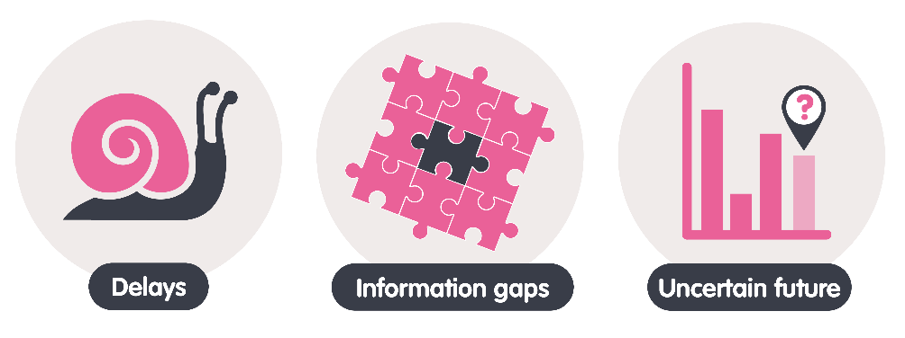

**Sam Young** | **25 November 2024**

Organisations in every sector are embracing AI to improve efficiency and reduce operating costs. If we’re aiming for decarbonisation then that misses the point.
 
Operating costs are seldom the sticking point holding us back from accelerating to Net Zero. High operating costs aren’t why the UK is failing to meet its heat pump installation targets. High operating costs aren’t why it takes over a decade to connect a wind farm to the electricity network. High operating costs aren’t why it is costing us more and more to balance the electricity network. AI can be used to accelerate us to Net Zero, but we need to apply it to the things that are actually slowing us down.
 
There are three big sources of friction that AI can really help with: delays, information gaps, and uncertainty about the future.

 
## Reducing delays with AI
Delays plague many of the processes that are core to decarbonising our energy system, from installing heat pumps to connecting wind farms to the network. Eliminating these delays would get us to Net Zero sooner.
 
Reducing or eliminating delays can have important effects on the whole system. It allows quicker feedback, so that things that work well are adopted faster and less time is wasted pursuing dead ends. It can change how willing people are to do things – people won’t wait for a heat pump in a few weeks if they can have a gas boiler today. And sometimes it can underpin completely new ways of doing things – imagine how hard remote working would be if we were still relying on snail mail.
 
We need to be asking: where can AI help make things that take weeks or days take only minutes?
 
How do we actually do that? Look at the processes involved in decarbonising our energy system. Talk to the people who live and breathe those processes. Examine all the delays and imagine what step changes could occur if some of those were eliminated. And then use AI’s delivery of efficiency to eliminate those delays.
 
## Overcoming information gaps with AI
Decisions rely on information. We have many decisions to make in the transition to Net Zero, and often key information is missing. Which houses would benefit most from insulation? Where are people going to charge their electric vehicles (EVs)? When will an industrial site be connected to a hydrogen network? We can make better decisions about future investment if we know the answers to those questions.
 
Now AI can’t answer many of those questions directly. In fact, traditional economic modelling is often a better tool for long term planning. But AI can help in two ways: new sources of information and more accurate short-term predictions.
 
Often records about buildings and assets are incomplete and outdated, and updating those manually is incredibly time consuming and expensive. AI offers the ability to use less traditional data sources like satellite imagery, LiDAR or thermal imaging to gather data quickly and at scale. For example, if you don’t have a database of existing rooftop solar in an area you can use AI to pick them out of satellite images.
 
If it’s too slow and expensive to collect the data you need manually, ask “could AI help gather this data at scale?” The data won’t be perfect (no data ever is), but if we need it to make good decisions quickly, then AI can help.
 
## Predicting the short-term future with AI
Whilst information to improve long-term decisions is important, accurately predicting the short-term is also key to decarbonising our energy system. In an increasingly decarbonised, decentralised energy system, balancing supply and demand on a minute-by-minute basis is getting more difficult – and more costly. The more accurately we can predict the state of the system over the next few hours and days, the easier and cheaper it is for the system operator to keep it stable.
 
But it’s not only the system operator who depends on good short-term forecasts. The business models of the flexibility providers that our system will increasingly rely on – from battery storage to demand response and smart EV charging – are fundamentally dependent on accurate short-term forecasts. The better at forecasting they are, the more easily they can make money providing services to the grid.
 
We need to look for opportunities to use AI to improve short-term predictions in ways that support a decarbonised energy system.
 
AI has the potential to be a powerful tool for accelerating decarbonisation, but only if we apply it to what is slowing us down. We should be focused on how it could eliminate important delays, accelerate access to information that is critical for investment decisions, and improve the short-term predictions the sector relies on.
 
So the next time someone pitches an exciting AI use case to you, stop and ask yourself: is this really going to accelerate us to Net Zero?
 
If you need more inspiration, I talk more on the topic [here](https://www.youtube.com/watch?v=AqzKEXqrUb0&t=2435s&ab_channel=DigitalCatapult), or you can have a look at our [AI for decarbonisation challenge cards](https://es-catapult.github.io/advice-challenge/) and our webinars on [AI for Flexibility](https://www.youtube.com/watch?v=vMc4-JD2-lk&ab_channel=EnergySystemsCatapult) or [AI for Home Decarbonisation](https://www.youtube.com/watch?v=3KW-IynOUw4&ab_channel=EnergySystemsCatapult).
