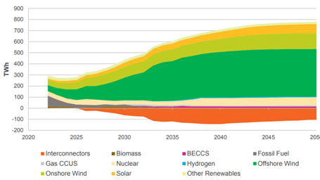
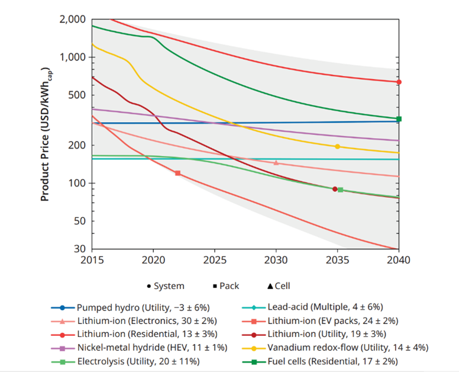
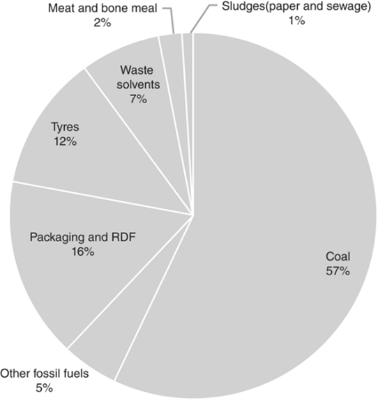
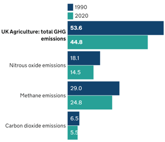
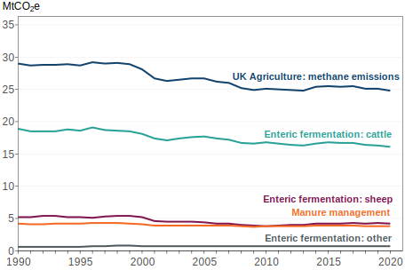
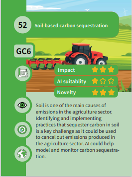
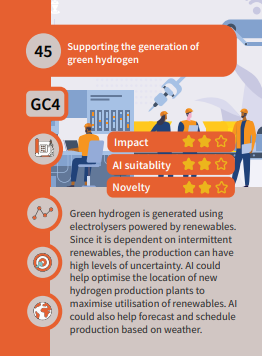
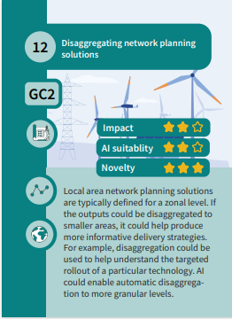

Dr Stephen Haben and Sam Young

**December 2023**

**Contents**

[1. Executive Summary](#executive-summary)  
[2. Introduction](#introduction)  
[3. AI's role in Decarbonisation](#ais-role-in-decarbonisation)  
[4. Challenges Selection Methodology](#challenges-selection-methodology)  
&nbsp;&nbsp;&nbsp;&nbsp;[4.1. Sectors](#sectors)  
&nbsp;&nbsp;&nbsp;&nbsp;[4.2. Identifying Challenges](#identifying-challenges)  
&nbsp;&nbsp;&nbsp;&nbsp;[4.3. Phases](#phases)  
&nbsp;&nbsp;&nbsp;&nbsp;[4.4. Scoring Criteria](#scoring-criteria)  
&nbsp;&nbsp;&nbsp;&nbsp;[4.5. AI Capabilities](#ai-capabilities)  
[5. The Grand Challenges](#the-grand-challenges)  
&nbsp;&nbsp;&nbsp;&nbsp;[5.1. Unlocking Domestic Decarbonisation (GC1)](#unlocking-domestic-decarbonisation-gc1)  
&nbsp;&nbsp;&nbsp;&nbsp;[5.2. Enabling Net Zero Infrastructure (GC2)](#enabling-net-zero-infrastructure-gc2)  
&nbsp;&nbsp;&nbsp;&nbsp;[5.3. Maximising Flexibility in Energy Networks (GC3)](#maximising-flexibility-in-energy-networks-gc3)  
&nbsp;&nbsp;&nbsp;&nbsp;[5.4. Decarbonising Manufacturing Inputs (GC4)](#decarbonising-manufacturing-inputs-gc4)  
&nbsp;&nbsp;&nbsp;&nbsp;[5.5. Manufacturing Process Efficiency (GC5)](#manufacturing-process-efficiency-gc5)  
&nbsp;&nbsp;&nbsp;&nbsp;[5.6. Optimising Soil Management (GC6)](#optimising-soil-management-gc6)  
&nbsp;&nbsp;&nbsp;&nbsp;[5.7. Minimising Methane in Agriculture (GC7)](#minimising-methane-in-agriculture-gc7)  
[6. Next Steps](#next-steps)  
[7. Appendix: Challenges Longlist](#appendix-challenges-longlist)
&nbsp;&nbsp;&nbsp;&nbsp;[7.1 Energy Challenges](#energy-challenges-longlist)  
&nbsp;&nbsp;&nbsp;&nbsp;[7.2. Manufacturing Challenges](#manufacturing-challenges)  
&nbsp;&nbsp;&nbsp;&nbsp;[7.3. Agriculture Challenges](#agriculture-challenges-longlist)  
&nbsp;&nbsp;&nbsp;&nbsp;[7.4. Built Environment Challenges](#built-environment-challenges)  
&nbsp;&nbsp;&nbsp;&nbsp;[7.5. General Challenges](#general-challenges)  
[8. Appendix: Challenge Cards](#appendix-challenge-cards)  
[9. Appendix: Challenge Selection Resources](#appendix-challenge-selection-resources)  
[10. Acknowledgements](#acknowledgements)

# Executive Summary

As outlined in the ADViCE ecosystem report, many current applications of
AI in high emissions sectors like energy and manufacturing largely focus
on efficiency and cost reduction. However, there are applications of AI
which could more directly accelerate decarbonisation in these sectors.

This report aims to accelerate the use of AI to drive decarbonisation in
the UK by highlighting decarbonisation challenges that AI could help
address. There are seven grand challenges:

1.  **Unlocking Domestic Decarbonisation**: Decarbonising homes requires
    changes to both heating systems and consumer behaviours in every
    home in the UK. Engaging consumers in that process, financing it,
    and delivering it at pace are all major challenges.

2.  **Enabling Net Zero Infrastructure**: Electrification of heating and
    transportation, combined with increased renewables mean the UK needs
    significant expansion of our electricity networks. Delivering at the
    required scale -- and particularly pace -- is a real challenge, with
    lots of renewable generation being held up due to delays or
    uncertainty in network connections. 

3.  **Maximising Flexibility in Energy Networks**: An electrified, high
    renewables future requires energy demand to flex, so users consume
    and store energy when the wind is blowing, and the sun is shining.
    This requires a radical change in how networks, markets and end
    users operate, which also requires an introduction of new
    technology, presenting a host of new challenges.

4.  **Decarbonising Manufacturing Inputs**: Many manufacturing processes
    rely on carbon intensive fuels and/or raw materials. Decarbonising
    manufacturing requires a wholesale redesign of processes and
    products to use low carbon inputs, but this is complex and costly. 

5.  **Manufacturing Process Efficiency**: For processes that are
    extremely hard to fully decarbonise, improving their efficiency is
    important in reducing emissions. This shouldn't come at the expense
    of decarbonising inputs but may help accelerate decarbonisation in
    the short term for processes.

6.  **Optimising Soil Management**: In agriculture, soil is a major
    source of emissions -- as well as a potential route to carbon
    sequestration. Optimising the management of soil health from an
    emissions perspective is a key challenge. 

7.  **Minimising Methane in Agriculture**: Methane emissions from
    livestock are a major contributor to global emissions. Reducing
    these emissions is critical, whether through shifting to low-meat
    diets or more carbon-conscious livestock management.

Within each grand challenge there are multiple individual sub
challenges, each highlighting more specific area where AI could be
beneficial. Each sub challenge may require different techniques and
expertise, highlighting different ways to address the grand challenges.

Hopefully one or more of these challenges will capture your imagination
and trigger ideas for how you might be able to apply AI to
decarbonisation, the greatest challenge facing our generation. Talk to
us about how we can help you make that happen!

You can join in the discussion of the challenges and how to solve them
via the ADViCE working groups and webinars.

# Introduction 

This report is part of *Stream 1* of UK Government's [*Artificial
Intelligence for Decarbonisation Innovation
Programme*](https://www.gov.uk/government/publications/artificial-intelligence-for-decarbonisation-innovation-programme),
establishing the [*AI for Decarbonisation's Virtual Centre for
Excellence
(ADViCE)*](https://es.catapult.org.uk/project/advice-initiative/)
delivered by Digital Catapult, Energy Systems Catapult and The Alan
Turing Institute (ATI). It describes the most important decarbonisation
challenges where AI has the potential to make significant impact. It
complements the Ecosystem report which identifies key organisations,
project and trends in AI for decarbonisation. This report highlights
areas where AI has not been extensively applied and consequently where
there is significant potential for progress and innovation.

The report describes the context for the challenges and presents the
seven key grand challenges across the sectors of Energy, Manufacturing,
Built Environment and Agriculture. This is followed by a discussion of
the more general challenges facing the application of artificial
intelligence to meeting Net Zero. Finally, we include the next steps and
final recommendations.

This report is aimed at practitioners, decision makers, and researchers
across the respective sectors. Tackling the grand challenges will
require significant effort and resources from industry, academia, and
government. For organisations in energy, agriculture, or manufacturing,
solving the challenges here not only accelerates decarbonisation but
also offers new business opportunities and areas for innovation. For
practitioners and researchers, they offer new applications of AI, and
opportunities for novel algorithm implementations. For private and
public sector funders, the report highlights the areas which may require
significant investment and attention.

This and the Ecosystem report provide the foundation for the continued
activities of the ADViCE programme which will include engaging the AI
and decarbonisation communities to tackle the challenges presented and
help support those who are working on them.

# AI's role in Decarbonisation

This section briefly describes the importance of identifying major
challenges for decarbonisation, the opportunities provided by AI, and
the approach used to define them.

The need to decarbonise has been laid in detail in the Ecosystem report.
In summary, human-driven climate change, through the emission of
greenhouse gases is forcing significant changes in the environment,
leading to extremes in weather and climate, increased risk to people,
nature, and food security. Many nations, and regions, have declared a
climate emergency and are committed to minimising the most significant
impacts of climate change.

Achieving this, will require a diverse range of political, social, and
technological solutions, to both mitigate the effects and adapt to the
inevitable changes that will occur to the economy and environment within
which it sits.

AI is one tool which can help tackle challenges (or elements of
challenges) which are difficult to address with other approaches. The
rapid development of sensor technology and computational resources have
created the opportunity for artificial intelligence to realise
significant value in the everyday lives of people in the UK, and the
wider world. The techniques and methods of AI, applied to increasing
amounts of collected data, can provide insights and models of complex
phenomenon and relationships which previously had been intractable. The
ability to assimilate large quantities of data and turn them into
actionable insights has enabled new innovations and business products
ranging from drug pharmaceutical discoveries to image processing, and
the prospect of a vast array of applications such as advanced chat bots,
code development assistance and creative writing, that are unlocked by
large language models (LLMs).

Despite the rapid progress in AI, the application of it to
decarbonisation has lagged somewhat. As explored in the Ecosystem
report, there are multiple reasons for this, including limited amounts
of granular data, a lack of skills, culture, and uncertainty around the
value of changing processes to incorporate data-driven methods. However,
if the UK is to meet its Net Zero targets, urgency is required, and will
necessitate the utilisation of all available tools to decarbonise these
sectors.

There are now significant digitalisation efforts across the energy,
built environment, agriculture and manufacturing sectors, which means
more data is available for AI applications. There is clear value as it
can enable more products and services, costs savings, but most
importantly opportunities to decarbonise. For example, the roll out of
smart meters and the development of new energy products for building
owners is creating opportunities for consumers to modify their
behaviours, reduce consumption and adopt low carbon technologies.

Although there is a range of possible applications which AI could be
applied across these four sectors, their potential decarbonisation
impact varies. In general, applications of AI in these sectors have
often been focused primarily on efficiency and cost reduction, rather
than decarbonisation specifically.

Therefore, the aim of this report is to not only try and provide a list
of challenges where AI can help support decarbonisation across energy,
built environment, agriculture, and manufacturing, but highlight areas
where AI can have the greatest impact and where there is still
significant research and investigation required.

We hope that this report can serve as inspiration and motivation to
those in the AI community to apply their skills, techniques and insights
to help to drive these decarbonisation challenges forward and make a
real, impactful difference.

# Challenges Selection Methodology

This section describes the methodology for selecting challenges,
including:

-   the criteria used to score their potential impact;

-   the suitability of AI to help solve them, and;

-   the relative attention these challenges have received from the AI
    community to date.

## Sectors

The focus of ADViCE is the following four main sectors: 

-   Agriculture: farming, livestock, supply chain and distribution.

-   Built Environment: Residential, transport and commercial
    infrastructure.

-   Energy: Renewables, network infrastructure and assets, and energy
    management.

-   Manufacturing: Steel making, cement production, chemical processing,
    machines, and robotics.

More details about the specific industries can be found within the
Ecosystem report. The choice of these industries is specifically due to
the large contribution they make to greenhouse gas emissions in the UK,
and the difficulty of decarbonising them.

## Identifying Challenges

For AI researchers and developers, a major barrier to identifying
valuable opportunities for AI is understanding industry problems in
sufficient detail. For this reason, a key approach to identifying
challenges and systemic blockers to decarbonisations is to interview
subject matter experts. Decarbonisation challenges where the exact
application of AI is unclear have therefore sometimes been intentionally
included to broaden perspectives and focus on major blockers, and not
merely the ease with which AI can be applied.

This top-down, decarbonisation first approach was supplemented with a
bottom-up approach looking at existing AI applications. The combination
of these two approaches ensures that gaps and new opportunities have
been identified thoroughly and effectively.

To gather the challenges in these areas, a combination of methods has
been applied including interviews, surveys, and desktop research. For
the top-down approach the focus was on interviewing experts in different
areas of decarbonisation. For the bottom-up approach the focus was on
desktop research, including identifying appropriate white papers on the
topic; the use of databases on energy projects (including the [UKRI
gateway](https://gtr.ukri.org/), [ENA's Smarter Networks
Portal](https://smarter.energynetworks.org/) and Energy System
Catapult's [CoPED Catalogue](https://coped.energy/)); and academic
literature highlighting the research that has already been applied. A
list of many of the resources used can be found in [Appendix 9](#appendix-challenge-selection-resources).

## Phases

When categorising the challenges, they were typically related on one of
the following phases of asset or product management:

-   **Design & Planning**: These are challenges focused on future,
    longer term solutions such as designing new products, or developing
    new technologies. They also focus on any planning applications, such
    as determining where to build new infrastructure, or what
    investments to make.

-   **Management & Operations:** These challenges focus on day-to-day
    operations for each sector. For example, this could be determining
    schedules for battery management, or logistics for manufacturing
    distribution.

-   **Maintenance and & Anomaly Detection**: These challenges focus on
    maintaining equipment, but also are concerned with identifying and
    locating faults and making sure any machinery or infrastructure is
    working properly or with optimal energy efficiency.

-   **Incentives & Customer Support**: These challenges focus on
    incentives to drive decarbonisation behaviours in different
    stakeholders, as well as relationships with customers of the
    different sectors.

These categories enable sector workers in relevant roles to quickly
isolate applications that are relevant to them. They also allow AI
practitioners to identify cross-sector opportunities where they have
existing solutions in one of these phases, which could be applied to
similar challenges in other sectors.

## Scoring Criteria

To isolate the most important and impactful challenges we developed a
scoring system focused on three main criteria:

-   Decarbonisation impact

-   Suitability for AI

-   Potential novel applications

These criteria were used to score the list of specific sub-challenges
for each sector (which can be found in [Appendix 8](#appendix-challenges-longlist)). Any
challenge which scored zero in any of the three main scoring categories
was not included.

The final grand challenges ([Section 5](#the-grand-challenges)) were selected by considering
clusters of sub-challenges with common themes and which consistently
scored relatively highly in each of the three scoring categories. Each
of the scoring criteria are described in more detail below.

### 4.5. Decarbonisation Impact  

The most important criterion for the challenges is the potential
decarbonisation impact. This includes consideration of the scale of
emissions reduction that could arise from solving the challenge or how
critical a blocker to decarbonisation this solution would address.

The levels used to qualitatively score this criterion are on a scale 0
to 3 (with 0 lowest) with the following high-level descriptions:

0.  Negligible decarbonisation impact

1. Decarbonisation impact is well defined but relatively small scale OR decarbonisation impact is hard to define but potentially larger

2.  Has the clear potential to reduce emissions at medium scale

3.  Has the clear potential to reduce emissions at a large scale

Any challenge that scores zero in this area is not be considered and is
not included in the long list of sub challenges in [Appendix 8](#appendix-challenges-longlist).

### 4.6. Suitability for AI  

This criterion determines whether the challenge can effectively be
addressed with AI. It may be that only some components can, and others
cannot, or in the best-case scenario, the entire challenge is purely
solvable by AI. It may be that in some cases the challenge could
potentially be solved, with AI, but there are other blockers which
reduce its suitability. It could be that the data is simply not
available in the short-term, or that it depends on other technologies,
or perhaps updates to policies and regulations.

The levels used to score these criteria are on a scale 0 to 3 (with 0
lowest) with the following high-level descriptions:

0.  AI is a very poor fit, the data is not available, and/or the
    challenge solution is more naturally aligned with other tools

1.  Suitable data would be hard to obtain and/or AI could only address
    minor components of the challenge

2.  AI could address key components of the challenge, and access to
    suitable data is probably possible

3.  Most of the challenge could be addressed with AI, suitable data are
    available (and suitable algorithms may already exist) 

Any challenge that scores zero in this area is not considered and is not
included in the long list of sub challenges in [Appendix 8](#appendix-challenges-longlist).

### 4.7. Novel AI Applications

This criterion considers the novelty of AI applications in the specific
challenge. It could be that the suitability of AI methods is very high,
but research, development, and investment in this area is already well
established and additional attention would have limited impact.

The levels used to score this area are on a scale 0 to 3 (with 0 lowest)
with the following high-level descriptions:

0.  Lots of attention on this challenge, with major investment flowing
    in and multiple forms of innovation occurring

1.  Well understood area for research and funding, with some significant
    activity

2.  Limited activity and funding trying to address this challenge with
    AI

3.  Close to no activity trying to address this challenge with AI

Any challenge that scores zero in this area is not be considered and is
not included in the long list of sub challenges in [Appendix 8](#appendix-challenges-longlist).

## AI Capabilities

We have also provided information on what AI capabilities are required
for each challenge in the main grand challenges [Section 5](#the-grand-challenges). These
include:

-   Time Series: Many sensors measure variables like energy, weather,
    and other values that vary over time. Analysing this requires a host
    of techniques and tools which are specific to this type of data,
    including time series analysis, forecasting methods and specific
    databases. AI for time series has yet to see the same
    transformational breakthroughs that vision and language have had in
    recent years.

-   Optimisation: Many of the challenges require finding the optimal
    solution to a problem. Optimisation methods, whether conventional
    mathematical techniques or approaches like reinforcement learning,
    are therefore vital to find the best solution(s).

-   Geospatial: Geospatial data is any data related to locations on
    earth and is therefore a key component of any mapping tool, or
    satellite imagery. This plays an important role in
    [energy](https://es.catapult.org.uk/report/energy-related-gis-data-landscape/),
    built environment, and agricultural applications where the position
    of assets, machinery or planning is required. This will typically
    also involve using unique geospatial file types such as Hierarchical
    Data Formats (HDF).

-   Visual: Visual data from satellites and cameras are increasingly
    important and are used in very specific AI applications such as
    image recognition. The challenges can be used to identify faults,
    for example, and are usually stored as tensor data, which has
    multiple attributes linked to each visual point, such as colour, or
    contrast.   

-   Language: Text mining and natural language processing can be used to
    extract information from text. Recent large language models (LLMs)
    such as ChatGPT have started to demonstrate the vast array of
    applications and possibilities from assimilating large amounts of
    data from text and documents.

-   Other Machine Learning: There are a variety of other machine
    learning techniques that may be applicable to specific challenges,
    from regression and classification on tabular data through to
    physics-informed neural networks.

These specific capabilities are listed to help AI practitioners
determine which challenges they could quickly provide some significant
contribution based on their skill set.

# The Grand Challenges

## Unlocking Domestic Decarbonisation (GC1) 

**Summary:** Without successfully decarbonising homes and domestic
transport there is very little chance for successfully meeting the UK' s
Net Zero targets. Residential heating is responsible for more than [13%
of greenhouse gas emissions each year](https://es.catapult.org.uk/guide/decarbonisation-heat/). Decarbonising homes requires
changes to both heating systems and consumer behaviours in every home in
the UK. Engaging consumers in that process, financing it, and delivering
it at pace are all major challenges. 

**Sector:** Built environment 

**Detailed challenge description:** One of the most promising strategies
for domestic decarbonisation is to electrify our heating and transport,
through heat pumps and electric vehicles (EVs) respectively. However,
while uptake of these technologies is accelerating [^2], [^3], they
remain a small percentage of the overall stock. For example, only 18% of
all vehicles[^4] purchased globally in 2023 are electric, and as of
April 2023 the UK has only installed 380,000 heat pumps[^5].

*Figure 1. Installations of air source heat pumps (ASHP) and ground
source or water source heat pumps (G/WSHP) in the UK from 2010 to 2022.
Data from [MCS
database](https://datadashboard.mcscertified.com/InstallationInsights).*

One of the main barriers to adoption of new technologies is the lack of
trust, especially in contrast to conventional boilers and vehicles which
have known reliability and understanding. This is a challenge both with
consumers and heating installers, who have the largest influence over
what gets installed.

There is a significant shortage of skills - recent figures show there
are around 3,000 heat pump installers operating in the UK, but this
needs to increase to at least 50,000.[^6] This is partly because
existing heating installers are used to fitting oversized boilers which
typically do not require a detailed design of the heating system --
unlike heat pumps -- and therefore haven't developed the required
skills. This shortage results not only in delays to installation, but
also the limited competition means feedback loops on cost and quality
are weak and progress is slow. This also hinders public trust, and hence
uptake, of the technology.

In addition, although most homes are suitable for heat pumps[^7], energy
efficiency improvements through retrofits, will significantly reduce
running costs. The performance of retrofits can be very dependent on the
quality of assessment, installation and commissioning, and there is
often significant variation in quality and consumer outcomes.

Cost remains a barrier, in particular for heat pumps, although
government initiatives have attempted to encourage uptake through
incentives such as the recent Boiler Upgrade Scheme[^8]. Installation
costs typically make up a significant proportion of overall costs for
heat pumps, demonstrating the need to find solutions that reduce this
cost component.

In addition, several high demand technologies, including heat pumps and
electric vehicle chargers, can require approval before connecting to the
network to ensure they do not create network capacity issues. If
numerous such connections are made, they risk outages on the network and
may require expensive reinforcement (digging up the road and fitting new
cables), network management technologies, or interventions such as
storage or demand side response[^9].

**AI Driven solutions:** To accelerate uptake, AI can be used to improve
planning, design and operation of low carbon homes.

At the planning stage, AI can be used to identify optimal retrofit
pathways for different consumers and properties using data collected at
scale or for individual properties. This can be combined with
personalised information and guidance to consumers on retrofits to
maximise uptake.

In the design stage, AI can automate key elements of the design process
(e.g., calculating heat loss) and therefore simplify, standardise and
accelerate the process, helping mitigate the skills shortage and
improving quality.

AI can also help optimise the operation and management of smart systems
in homes. This can involve learning from smart meter data and other
in-home sensors to understand behaviour patterns, optimising control of
smart appliances to reduce cost and emissions, and tracking energy
savings and building performance. Such energy management can expand to
help support the wider local energy network and ensure the capacity of
cables and assets are not exceeded.

**Related Sub-Challenges:** Some of the core sub-challenges for this
Grand challenge are as follows and are listed in the appendix section
7. 

-   Challenge 15: Customer information and guidance 

-   Challenge 16: Driving energy efficient behaviours 

-   Challenge 17: Abstracting away complexity for consumers 

-   Challenge 18: Supporting vulnerable customers 

-   Challenge 62: Identifying and targeting optimal retrofit measures 

-   Challenge 63: Retrofit design 

-   Challenge 64: Retrofit approvals 

-   Challenge 65: Retrofit installation and commissioning

-   Challenge 67: Measuring retrofit impact 

-   Challenge 68: Standardised building performance ratings

**AI Capabilities:** The AI solutions for this challenge will mainly
require the following high-level capabilities to achieve (although note
there may be other less obvious solutions and approaches which could use
other capabilities): 

-   Time Series: In-home sensors and smart meter data are key to
    understanding energy usage and therefore the occupants' needs, and
    the impact of any retrofits.

-   Optimisation: The aim of many solutions is to optimise the energy
    savings and identify the best technology or retrofit for the home.

-   Visual: Visual data, such as infrared cameras for heat signatures,
    could help build an accurate picture of the options for a home. For
    example, arial photographs could identify the orientation of a
    house, identifying the suitability of a PV solar system.

-   Language: Much of the data about the properties and occupant
    preferences will come from reports and surveys of the occupants.
    Utilising this information can help understand the best solutions
    for the individuals.

-   Geospatial: The location of a home could be as important to the
    solutions as the energy usage. Isolated regions may be unsuitable
    for EVs which require long distance journeys. A location near an
    abandoned coal mine may indicate a heat network as the optimal
    domestic heating solution.

## Enabling Net Zero Infrastructure (GC2) 

**Summary:** Electrification of heating and transportation, combined
with increased renewables mean we need both significant expansion of our
electricity networks and ways to manage network constraints. Delivering
at the required scale -- and pace -- is a real challenge, with lots of
renewable generation being held up due to delays or uncertainty in
network connections. 

**Sector:** Energy 

**Detailed challenge description:** Net Zero cannot be achieved without
accelerating the installation of renewable generation. To decarbonise
the power system, 180-220 GW of grid-connected capacity will be needed
by 2035, requiring 6 to 9 GWs to be installed per year[^10].

 
  
 
*Figure 2. Total electricity generation output for the \"Leading the
Way\" future energy scenario. From National Grid, [Future Energy
Scenarios,
2023.](https://www.nationalgrideso.com/document/283101/download)*

Demand for electricity is expected to approximately double out to
2050[^11]^,^[^12], with the significant electrification of heating and
transport. It will also increase the peak demand where some applications
coincide (e.g., the use of electrified heating on cold days will
coincide across many homes). In addition, decarbonising industry will
require fuel shifts -- probably to both hydrogen and electricity (see
Grand Challenge 4) -- and therefore significant network infrastructure
will be required to enable this.

These factors combined mean that significant investment in
infrastructure is required -- not only building new renewable
generation, but also new transmission and distribution networks to
service new loads and connect new generation. However, queues for
connecting renewables at distribution level can take up to 15
years[^13], which means renewables take much longer than necessary to be
available to consumers. Shortening this is critical to decarbonising our
energy system by 2035.[^14]^,^ [^15]^,^ [^16]

A key component of this challenge is the uncertainty about future
network requirements. Both the choice of energy vector (electricity,
hydrogen) and the pace of rollout have major implications for network
planning -- but what network capacity will be available in the future
often determines the choice of energy vector and the pace of rollout.
Ideally, new infrastructure should be optimised in such a way that every
year the upgraded network has sufficient capacity and at locations where
it is most needed. This is also important for ensuring energy security
and grid stability. The connections for renewables and industry
therefore require careful consideration of the network capacity, which
makes determining optimal locations complex.

The planning and investment in network infrastructure is therefore a
very challenging task which requires optimising a range of objectives
(such as safety, risk, operational costs, and capital expenditure)
across multiple timeframes and sectors, all in the face of significant
uncertainty. With the additional requirements of ensuring the building
of high levels of renewable generation, and the move to decentralised
energy system, AI and data-driven techniques are going to be necessary
to support and optimise decision making to enable infrastructure
upgrades.

**AI Driven solutions:** Identifying the best industrial or renewable
connection requires optimisation of networks to maximise opportunities
whilst minimising the potential costs. This must take into several
constraints including location, climate, weather, asset and cable
ratings, consumer connections, renewable connections and network
topology. Therefore, optimising new network connections is a difficult
optimisation problem under uncertainty with limited data. AI can help
accurately solve this problem efficiently and evaluate millions of
different potential routes.

Evaluating these network options requires modelling detailed power
flows, but this is nontrivial for very large networks with minimal
monitoring. AI can be used to deal with missing or sparse data and
accelerate the speed of simulations.  

The future Distribution System Ooperators (DSOs) will need to know the
supply and demand requirements for a local area. This requires
understanding the likely network capacity and generation needs, and in
particular the possible peak demand. This is not a simple task as it
varies depending on the weather patterns, the uptake of Low Carbon
Technologies (LCTs), and how those LCTs are to be used. AI can help both
time series forecasting, and the generation of realistic demand profiles
that can be aggregated together to model peak demand.

Similarly, electric vehicle charge points are likely to be a major
disrupter of electricity networks since they have relatively high energy
demand and are likely to be used at the similar times (i.e., all
charging at home after work), creating new, possibly larger daily peak
demands. However, network limits are not the only constraints and other
impacts such as traffic, location and likely utilisation must also be
accounted for. AI can help optimise charging locations given the
combination of factors that need to be considered.

AI could also be used to manage electricity demand and resolve network
constraints, negating the need for some network infrastructure upgrades,
this is considered in Grand Challenge 3, Section 5.3. 

**Related Sub-Challenges:** Some of the core sub-challenges for this
Grand challenge are as follows and are listed in the appendix section
7. 

-   Challenge 5: Prediction of local generation and capacity needs 

-   Challenge 6: Designing Optimal Network Plans 

-   Challenge 7: Feasibility assessment for new renewable generation. 

-   Challenge 8: Routing new network infrastructure 

-   Challenge 9: Wind farm design 

-   Challenge 10: Deploying new EV charge points 

-   Challenge 11: Disaggregating network planning solutions 

-   Challenge 12: Multi-sector coordination 

-   Challenge 13: Connections Assessment and Approvals  

-   Challenge 28: Network Modelling with Missing and Sparse Data 

-   Challenge 42: Network Connections for Industrial Consumers 

**AI Capabilities:** The AI solutions for this challenge will mainly
require the following high-level capabilities (although note there may
be other less obvious solutions and approaches which could use other
capabilities): 

-   Geospatial: Energy network problems often have a significant
    geospatial component due to geographical concentrations in demand
    and supply. 

-   Optimisation: By definition, many of the problems stated above are
    one of optimisation - finding the balance between the constraints of
    the energy system, the costs and the natural environment.  

-   Time Series: Energy demand and supply are hugely variable over time,
    and infrastructure needs to be designed to cope with all
    combinations (particularly peak demand and generation). This
    requires consideration of energy and weather time series.

## Maximising Flexibility in Energy Networks (GC3) 

**Summary:** A high renewables future requires energy demand to flex so
we consume and store energy when the wind is blowing and the sun is
shining. This is a radical change in network and market operation which
also requires an underlying introduction of new technology and hence
presents a host of new challenges. In addition to improving the energy
efficiency of consumers (see Grand Challenge 1 and 5), energy demand and
generation will need to be managed, curtailed, and shifted to meet Net
Zero.  

**Sector:** Energy 

**Detailed challenge description:** Renewable generation is very weather
dependent and tends towards decentralised and specific locations. Making
the most of it (and balancing the system) therefore requires a
combination of shifting demand to match generation and storing energy
for future use.

*Figure 3. Cost projections for different storage technologies over time.
Taken from "Monetizing Energy Storage", Oliver Schmidt and Iain
Staffell, OUP, 2023, used under license [CC BY-NC-ND
4.0](https://creativecommons.org/licenses/by-nc-nd/4.0/).*

In addition, electrification of heating and transportation means new,
extremely large peaks in demand will occur. By default, these will both
significantly exceed the capacity of the electricity network and occur
at a different time to peak renewable generation. It is therefore
important to introduce flexibility into the system to align demand with
supply.

Storage has typically been expensive, but the costs are rapidly reducing
and expected to keep reducing, e.g., see the storage costs of batteries
(Figure 2), which means local storage will be increasingly viable as a
way to control the energy networks.

In addition, more devices, such as heat pumps and electric vehicles are
installed with communications and controllable technology meaning they
could be utilised to help support the network. However, optimally
controlling these devices is a non-trivial task, especially since there
is a need to optimise for multiple factors -- consumer needs, local and
national network constraints, local and national generation. Many of
these factors (e.g., renewable generation) are volatile and uncertain.
Similarly, at low voltage and building level energy usage can be
irregular and therefore more difficult to predict accurately.

Achieving a flexible energy system will also require modifications to
energy markets to provide the incentives for consumers to shift their
demand and provide mechanisms for this to occur. In some cases, more
decentralised energy markets and Locational Marginal Pricing (LMP)[^17],
are being considered as a way to help utilise the distributed energy
resources and help balance the network.

**The** **AI Driven solutions:** The future operation of electricity
networks will be highly complex, dependent on many nonlinear constraints
and volatile data. Yet the network must be balanced across the entire
hierarchy from household to transmission level. AI is a natural solution
for these challenges since it can better capture the highly stochastic
nature of low voltage demand and generation and produce more accurate
forecasts. AI can further be used to take these inputs and utilise them
in advanced optimal control strategies which can help balance the
network, and manage smart control systems to reduce peaks, better
utilise renewable energy on the network and reduce costs.

Where the calculations that underpin optimisation problems are
computationally intensive (for example with optimal power flows), AI can
be used to learn the characteristics of optimal outputs and reduce the
need to run so many simulations, therefore accelerating the
identification of optimal outputs.

AI is particularly suitable for the real time, distributed control of
multiple assets such as the batteries within electric vehicles. As low
carbon technologies increase the strain in localised areas of the
network, the batteries across connected EVs can be coordinated to help
support the network, creating incentives for users, whilst not
disrupting their utilisation of the car, or their journeys. In time,
many more solutions may become available through the increased
prevalence of smart appliances, enabling large turn-down from demand
side response and thus reducing peak demand issues.  

Forecasting is an important input for all these systems to enable the
estimation of the uncertainty of demand and generation produced. Used as
inputs, these forecasts allow control algorithms for storage devices to
better anticipate and prepare for peaks or troughs on the systems. AI is
able to develop the necessary advanced forecasts which can provide
granular information on the expected ranges of demand or generation, and
therefore the risk to the network. This is particularly important when
utilised within smart building control systems, where the demands are
relatively volatile and therefore cannot be captured by traditional
forecasting methods.  

**Related Sub-Challenges:** Some of the core sub-challenges for this
Grand challenge are as follows and are listed in the appendix. 

-   Challenge 19: Estimating Flexibility 

-   Challenge 20: Implementing Network Flexibility 

-   Challenge 21: Coordinated Community Control 

-   Challenge 22: Smart Electric Vehicle Management 

-   Challenge 23: Advanced Network Control 

-   Challenge 25: Weather Forecasting for improved system operation 

-   Challenge 26: Optimal Trading for Storage 

-   Challenge 27: Optimal Power Flow Calculations 

-   Challenge 30: Renewable Energy Forecasting 

-   Challenge 31: Forecasting for Network Management  

-   Challenge 32: Decentralised Market Solutions 

-   Challenge 66: Smart Building Control Systems 

**AI Capabilities:** The AI solutions for this challenge will mainly
require the following high-level capabilities (although note there may
be other less obvious solutions and approaches which could use other
capabilities): 

-   Time Series: Flexibility is entirely dependent on the time series
    data for demand, generation and weather. This data is required to
    produce forecasts and the past behaviour must be utilised to help
    schedule any storage or other flexibility applications.   

-   Optimisation: Flexibility is concerned with optimising the energy
    demand on the network according to network constraints, demand,
    generation, costs and other exogenous variables such as weather and
    network topology.  

-   Geospatial: Flexibility is strongly dependent on the topology on the
    networks. It must be understood what is connected, the potential
    effect of the weather or climate, and what other nearby assets could
    be used to provide flexibility.   

## Decarbonising Manufacturing Inputs (GC4) 

**Summary:** Many manufacturing processes rely on carbon intensive fuels
or raw materials. Decarbonising manufacturing requires a wholesale
redesign of processes and products to use low carbon inputs, but this is
complex and costly. 

**Sector:** Manufacturing 

**Detailed challenge description:** Manufacturing process are one of the
main causes of greenhouse gas emissions worldwide. Heavy industry is
responsible for nearly 40% of global CO2 emissions[^18] with the iron
and steel industry alone responsible for 11% of global CO2[^19] with 70%
produced by using coal. The emissions are caused by two main inputs:
fuel sources required for the production process (e.g. see Figure 3, for
fuel split for cement kiln heating), and feedstocks (i.e., raw
materials) used to create the manufactured outputs.

*Figure 4. Fuel split for heating of UK cement kilns in 2010. Taken [from
Industrial energy use and carbon emissions reduction: a UK
perspective](https://wires.onlinelibrary.wiley.com/doi/full/10.1002/wene.212),
by P. Griffin, G. Hammond, and J. Norman, shared under [CC BY
4.0](https://creativecommons.org/licenses/by/4.0/) license.*

Switching fuels is an obvious way to decarbonise, but many products
require high temperatures (several hundred degrees C), which can be
costly or difficult to achieve with electricity. However, for
medium-to-low temperature processes and space heating, electricity is
often a cost-effective option (particularly with waste heat
recovery)[^20]. Redesigning processes to use lower temperatures to
enable cost-effective electrification is a potential route to
decarbonisation.

An alternative option for processes where electrification is less viable
is to utilise hydrogen. Zero carbon green hydrogen can be generated
using electrolysers powered by renewables (or nuclear). This would
require the location of new hydrogen production plants to be chosen to
optimise green hydrogen production. Adaptation of existing processes to
use hydrogen would also be required[^21].

A disadvantage of fuel switching is the significant capital expenditure
and disruption required to transition to the new fuel source. Some of
the equipment will need to be retrofitted or completely rebuilt[^22].

There are a few options available to manufacturers to cut the costs of
this transition. Onsite renewable generation could lower costs by
reducing electricity imported from the grid and avoiding network costs.
This could be used directly or to help produce green
hydrogen. Alternative market solutions, such as private wires, virtual
power plants, or different energy procurement strategies can also help
lower costs[^23].

There is another challenge with fuel switching, and that is the new
network connections that will be required. Many methane gas pipes are
hard to repurpose for the use of hydrogen and switching fuels will be
dependent on where the connections are planned and when they will be
complete[^24].  

The other main contributor to manufacturing emissions is feedstock. Some
processes, such as steel making, use high carbon materials such as coal.
Others require materials which release lots of CO~2~ when processed, for
example, limestone must be heated in cement production, and this
releases lots of CO~2~. So decarbonising these manufacturing inputs
requires either changing to lower (or zero) emission alternatives, or
implementing carbon capture, utilisation and storage (CCUS) to remove
the emissions produced. For example, coal is used as a reducing agent in
steelmaking but hydrogen could also be used[^25] (in this case to use
direct reduced iron, and the only output is water[^26]). Once again to
decarbonise feedstock requires finding alternatives, in many cases
hydrogen, which must be generated, with the manufacturing equipment
upgraded or retrofitted to deal with the changing processes.  

**AI Driven solutions:** Many of the solutions for decarbonising the
inputs to manufacturing are expensive and require significant upgrades
to equipment or even a completely new redesigned plant. AI can play a
role in reducing costs for this transformation.  

One of the main ways that AI can support is through the design of new
low carbon feedstock alternatives. Instead of expensive physical
experiments and testing, AI can produce designer molecules and chemicals
with particular desirable properties or suggest synthetic processes.
Simulation-based testing of thousands or even millions of alternatives
can be performed before any real laboratory environment production is
required. The utilisation of AI in the design can be extended to the
full manufacturing process, considering alternative methods, new
equipment, or even an entirely new plant to enable different fuels, or
reduce waste.  

AI can also optimise and manage the production of green hydrogen,
controlling the electrolyser to make the most efficient use of the
intermittent renewable generation[^27]. This could also be integrated
with storage systems to increase flexibility (See Grand Challenge 3).  

Finally, AI could be used to improve carbon accounting and modelling.
Better carbon accounting would strengthen incentives for manufacturers
to decarbonise. Although direct measurements are often missing, AI can
help infer and track the sources of emissions, potentially at more
granular levels than are currently monitored.

**Related Sub-Challenges:** 

-   Challenge 8: Routing new network infrastructure 

-   Challenge 13: Connections Assessment and Approvals  

-   Challenge 37: Design of Low Carbon Feedstock Alternatives 

-   Challenge 38: Design of Low Carbon Manufacturing Processes 

-   Challenge 43: Installing Onsite Renewables and Storage 

-   Challenge 44: Supporting the Generation of Green Hydrogen 

-   Challenge 50: Carbon Accounting and Modelling 

**AI Capabilities required:** The AI solutions to tackle this challenge
will require the following high-level capabilities (although note there
may be other less obvious solutions and approaches which could use other
capabilities): 

-   Optimisation: Since design of optimal feedstock and processes is a
    core element of the challenge, optimisation is clearly a capability
    that is required.   

-   Time Series: Time series processing is a major input to the
    optimisation, especially for the renewable energy generation and
    weather data required to understand green hydrogen production.   

-   Visual: Visual data may be useful in carbon accounting, as well as
    for chemical process and manufacturing process design.  

-   Other Machine Learning: Regression and classification approaches can
    be important for carbon accounting.

## Manufacturing Process Efficiency (GC5) 

**Summary:** For processes that are extremely hard to fully decarbonise,
improving their efficiency is important in reducing emissions. This
should not come at the expense of decarbonising inputs but may also help
accelerate decarbonisation in the short term for processes that will
eventually be fully decarbonised. 

**Sector:** Manufacturing 

**Detailed challenge description:** Manufacturers have obvious
incentives to improve process and energy efficiency, and this will be
required to help decarbonise the sector. However, it is important that
this does not divert attention and investment away from decarbonising
inputs (which is often harder and more expensive, but important for full
decarbonisation). This is often the case - a survey of manufacturers^20^
showed that 47% saw energy efficiency as one of the key ways to reduce
emissions. In contrast only 9% focused on fuel switching for electrified
production and 8% focused on fuel switching to hydrogen.

Processes can be optimised for energy usage and emissions through
automation and advanced control of devices. However energy usage and
emissions is often not sufficiently monitored - the above survey found
that only 59% measure their electricity consumption and only 41% measure
their outright emissions. It is likely that very few individual
components of the manufacturing process are monitored in detail. This
creates several limitations: energy usage is likely to be poorly
understood; condition monitoring will be restricted; energy management
solutions are likely to be suboptimal; and energy inefficiencies cannot
be identified. This is particularly likely for SME manufacturers. 

Figure 5. Example of possible energy savings estimates (gigajoules per
tonne) in the steel production supply chain based on different heat
recovery scenarios. Taken [from Potential for energy savings by heat
recovery in an integrated steel supply
chain](https://www.sciencedirect.com/science/article/pii/S1359431116305877)
by McBrien et al. shared under license [CC BY
4.0](https://creativecommons.org/licenses/by/4.0/)..

Another drawback to limited monitoring is the difficulty with estimating
and understanding emissions. Without this information it will be
difficult to know how to reduce them, or which components provide the
biggest contribution or opportunity.

Reducing emissions (and energy costs) without impacting operations can
sometimes benefit from demand flexibility and energy storage. Shifting
production times to align with clean, cheap energy can be effective --
and storage can be used to smooth that out and reduce disruption
(although the upfront capital costs can be large).

Another source of emissions for manufacturers is distribution and
logistics. Although it is relatively simple to decarbonise domestic
vehicles, it is much more difficult to do the same for heavy goods
vehicles which could potentially be replaced with ones which can use
biofuels or hydrogen. Adapting transport logistics can also enable more
efficient fuel utilisations, either through optimal route planning, or
modifying the distribution chain.

**AI Driven solutions:** AI is well suited to optimising complex energy
management objectives. AI can handle a variety of inputs and can be
adapted to take into account different constraints. Therefore, whether
the management is through optimisation of production schedules, demand
side response, or battery storage scheduling, AI algorithms can be used
to help identify the best way to shift or turn-down demand, reducing
emissions and maximising savings. In many cases multi-objective
optimisation algorithms could be deployed to find the optimal solution
when there are several (possibly competing) objectives. 

Demand forecasting is another major application for manufacturing energy
management and is well suited to artificial intelligence methods. AI can
learn past behaviour through analysis of historical observations and can
infer the future expected demand for products and the corresponding
uncertainty. This therefore helps with scheduling of devices and
processes but also allows an assessment of the risks.  

AI can also be used to identify process inefficiencies. Combined with
high resolution monitoring, machine learning methods could isolate
inefficiencies and areas for optimisation. Assessing which processes may
need to be targeted with additional efficiency measures or energy
management solutions requires accurate carbon accounting and modelling.
AI can be particularly useful to estimate, track and reduce emissions,
and identify the contributions from the various components.

As shown above many AI algorithms are dependent on some degree of
historical training data and monitoring to be accurate. However, AI can
also be used to help solve missing data issues. Firstly, they can be
used to identify the optimal location and amount of monitoring needed to
develop accurate models and algorithms. This can be balanced with the
potential costs and computational requirements. This is particularly
important for manufacturing systems since they require specialist
measuring equipment such as probes for very high temperature areas.  

AI can also be used to generate accurate and useful estimates of
unmonitored systems. Transfer learning is a popular method for
simulating equipment or devices from a similar family (e.g., boilers).
This means monitoring can be kept to a minimum, and data from other
sites can add value. There is also a recent explosion in generative AI,
and such methods could be applied to meta-learn the behaviour of
unmonitored sites, even when there is limited monitoring of similar
sites.   

**Related Sub-Challenges:** 

-   Challenge 39: Manufacturing Process Efficiency 

-   Challenge 45: Energy Management in Manufacturing 

-   Challenge 46: Demand Forecasting for Manufacturing 

-   Challenge 47: Manufacturing Logistics and Distribution 

-   Challenge 48: Maximising Data Utility in Manufacturing Plants 

-   Challenge 49: Defect Identification in Manufacturing Products 

 **AI Capabilities required:** The AI solutions for this challenge will
mainly require the following high-level capabilities (although note
there may be other less obvious solutions and approaches which could use
other capabilities): 

-   Optimisation: Optimisation techniques are key to managing competing
    objectives and optimising processes. 

-   Time Series: Analysis of energy time series, production trends and
    sensor data can identify opportunities for improved efficiency.

-   Visual: Image processing may be used to detect equipment defects and
    process anomalies early and thus reduce wastage.  

## Optimising Soil Management (GC6)

**Summary**: In agriculture, soil is a major source of emissions -- as
well as a potential route to carbon sequestration. Optimising the
management of soil heath from an emissions perspective is a key
challenge. 

**Sector:** Agriculture 

**Detailed challenge description:** Nitrous oxide (N~2~O) emissions from
soil are responsible for 31% of all agricultural greenhouse gas
emissions, behind only enteric fermentation (48%)[^28] which will be
considered in challenge 7. In fact, agriculture forms 70% of all nitrous
oxide emissions[^29] , which pound-for-pound has about 265 times the
impact on global warming than carbon dioxide and stays in the atmosphere
for over 100 years[^30]. In agriculture these emissions primarily come
from applying nitrogen fertilizers to soil where the microbes convert
the nitrogen into N~2~O. However, they are also produced from organic
fertilizers like animal manure[^31]. 

Nitrogen fertilisers are necessary for soil health, plant growth and
development, controlling respiration, and photosynthesis. Artificial
fertilisers can help increase nitrogen levels and improve yields, but
their long-term use or over-fertilization can damage the soil
health[^32]. 

Emissions are generated by microbial reactions and depend on weather
conditions, physicochemical reactions, and proper soil management
practices^32^. This includes adjusting the time and method of applying
fertilisers, tillage and irrigation practices, use of biochar (materials
carbonised over high temperatures), nutrient management and different
crop rotations^32,^[^33].

Figure 6. Breakdown of total greenhouse gas emissions (in metric tons of
carbon dioxide equivalent) from agriculture and comparison of 1990 to
2020. [From Agri-climate report
2022](https://www.gov.uk/government/statistics/agri-climate-report-2022/agri-climate-report-2022),
Department for Environment Foord & Rural Affairs, used under [Open
Government Licence
v3.0](https://www.nationalarchives.gov.uk/doc/open-government-licence/version/3/).

Different crops generate different emissions and therefore adjusting
crop production can also be an effective strategy. It should be noted
that these different practices have to be carefully balanced, and
relationships and effects are not necessarily easy to model due to many
interdependencies between complex variables, behaviour dependencies,
climate effects and soil composition. Many empirical models of nitrous
oxide emissions are relatively inaccurate and unable to predict daily
and monthly emissions[^34].  

Soil can also play an important role in providing negative emissions
under the right conditions and management. Carbon could be sequestered
in agricultural soil, although there is still uncertainty about the
amount of potential sequestration[^35].   

Farming and land management can help to improve carbon storage through
reducing soil disturbance, adapting planting schedules, manging
livestock grazing, and composting with crop residuals (remains of crops
after harvesting)[^36]. 

However, sequestration has potential complications. If the soil is
distributed then the captured carbon can be released and it is difficult
to monitor and verify how much carbon has been sequestered^36^. The soil
sequestration potential also varies according to environmental factors,
anthropogenic effects, and soil types but is still not fully
understood[^37].  

**The AI Driven solutions** 

Overuse of fertilisers is one of the causes of higher nitrous oxide
emissions. Rather than using slow and more expensive methods to measure
properties of the soil, AI can help to accurately and quickly understand
the amount of fertiliser required, thus limiting emissions.   

Another way to reduce emissions is through the development of optimal
soil management strategies which could reduce N~2~O whilst not reducing
the crop yields. There are many different factors which effect the
emissions from soil (e.g., changing the amount and timing of tillage,
which crops to grow, irrigation-drainage management, crop rotation,
etc.) and thus there is a need for further investigation to identify the
core drivers, or combination of drivers. AI is a potential solution
since it can assimilate these various inputs and their complex
relationships, understand the key processes and identify optimal
solutions. 

AI could also be used to help identify and predict the distribution of
greenhouse gas emissions from agricultural systems. This could enable
targeted interventions for specific sites where emissions are
concentrated to improve soil health. Alternatively, AI could identify
the root causes of high emissions and therefore find suitable sites or
techniques with properties that are more likely to produce lower
emissions.  

For soil sequestration, AI could also be used to improve estimation of
carbon storage levels, since it is often difficult to monitor and verify
the health and carbon stored in the soil. By taking data from soil
monitors, weather, and satellite data, these algorithms can help farmers
understand particular attributes of their soil such as the carbon
stored, or the nutrient levels. These techniques could also be used to
try and improve the amount of possible sequestration through the
identification of optimal conditions and attributes. Targeted monitoring
and sampling could also help improve estimates or could be used to
reduce the amount of data required and enable streamlined operations and
management.  

AI techniques could be used to predict changes in soil health and carbon
storage potential from future weather events, climate change or changes
to the surrounding environment. They can model how the soil attributes
change to these different events, and even help to plan future, more
resilient sites.  

**Sub-Challenges and related challenge numbers:** 

-   Challenge 51: Soil-Based Carbon Sequestration 

-   Challenge 53: Fertiliser Design and Recommendations

-   Challenge 55: Prediction for Agricultural Resource Planning

-   Challenge 59: Soil Health Monitoring and Management

-   Challenge 60: Crop Monitoring and Management

**AI Capabilities required:** The AI solutions for this challenge will
mainly require the following high-level capabilities (although note
there may be other less obvious solutions and approaches which could use
other capabilities): 

-   Optimisation:  Optimisation techniques may be required to balance
    competing factors and make recommendations around optimal management

-   Visual: Analysis of images of crops and land can be essential in
    optimising soil and crop management

-   Geospatial: Analysing geospatial factors including weather, drainage
    and climate are essential to understanding factors influencing soil
    and crop health.

## Minimising Methane in Agriculture (GC7) 

**Summary:** Methane emissions from livestock are a major contributor to
global emissions. Reducing these emissions is critical, whether through
shifting to low-meat diets or more carbon-conscious livestock
management. 

**Sector:** Agriculture 

**Detailed challenge description:** Livestock are responsible for 41% of
agricultural greenhouse gas emissions^28^. This comes from emissions of
methane (CH~4~) from enteric fermentation (digestive processes) but also
from manure. Unfortunately, methane is a very potent greenhouse gas,
with a pound for pound impact 28 times greater than CO~2~^30^. As the
population grows, methane emissions are set to get worse without radical
interventions[^38].  

There are several ways that methane emissions from agriculture could be
reduced but they can be broadly categorised into lower carbon diets and
reducing the emissions from animals and their manure.  

Reductions in meat and dairy farming not only can reduce emissions but
could help improve food security and health, especially by reducing red
meat consumption. A reduction in the required livestock would reduce the
amount of land use for feed[^39]. Despite the increased awareness of the
positive impacts of moving to a non-meat based diet there is still
significant inertia and resistance. Some of the main challenges include
the need for healthy and similar plant-based meat and dairy
alternatives, but also making it easier to adopt a non-meat diet without
losing any nutritional benefits[^40].  

Figure 7. Total and breakdown of methane gas emissions from UK
agriculture. From [Agri-climate report
2022](https://www.gov.uk/government/statistics/agri-climate-report-2022/agri-climate-report-2022),
Department for Environment Foord & Rural Affairs, used under [Open
Government Licence
v3.](https://www.nationalarchives.gov.uk/doc/open-government-licence/version/3/)0.

To reduce emissions from animals involves reducing the methane levels
from enteric fermentation and manure.  The intensity of emissions varies
across different regions and production systems and is dependent on
environmental factors, nutrition, animal types and properties, and
farming practices[^41]. The main animal source of methane is from
ruminants such as cows, sheep and goats, who gain nutrients through a
plant-based diet which is fertilised through multiple stomachs before
digestion[^42] which then creates belching, releasing gas. Some farming
produces more emissions than others, for example cattle breeding and
production creates much more methane than sheep due to their size and
numbers^42^.  

Different properties of animals alter the levels of emissions including
growth rate, animal size, energy consumption, animal health, etc. ^41,^
^42^. Given many traits of the animals are heritable, this suggests
reproduction management may help slightly reduce emissions by focusing
on breeding offspring with features that reduce emissions (e.g.,
enhanced fecundity, reduced stress response, and better immunity)[^43].
 

Emissions can also be reduced for enteric fermentation by changing
animal feeding practices and types^30^. Evidence shows that the genome
and stomach microbiome can play important contribution to the methane
emissions, and they can be reduced by, for example, reducing forage diet
levels, and adding fat, biochar, and potassium nitrate^42^.

Methane is also produced from manure when it decomposes under aerobic
conditions. One way to reduce these emissions is through better manure
management, through shortening storage, compositing, aeration, and
manure acidification^38,^ ^43^. Methane can also be used as a renewable
energy source as a component of anaerobic co-digestion where the
application of microorganism converts the manure into a biogas[^44].  

**AI Driven solutions:** 

AI can play a key role in estimating and monitoring of methane
emissions. Data from sensors, satellite data, buildings and the animals
themselves can be used to derive models of emissions, identify key
drivers and inefficiencies, and understand ways to help improve
management of the farm and their outputs.  

AI can also be used to reduce the emissions from animals. Firstly, AI
can help to develop feed and feed additives so that the gas emissions
are reduced. Data driven techniques can analyse the outputs from
different animals under different conditions and feeding regimes to
understand what causes the greatest methane outputs. Alternatively
similar effects could also be estimated by directly studying and
modelling the reactions of gut microbiome to understand the underlying
chemical processes and predict the likely effects on emissions. This
research could further be used to develop designer feed which provides
the optimal emissions reduction.  

Lower emission traits in livestock can be produced by selected breeding
practices. AI can support this through identifying microbial properties
and genetics which are best suited for lower CH~4~ emissions. Genetic
differences and similarities across livestock can be isolated and then
used to determine the optimal breeding management practices to reduce
overall herd emissions.  

AI is also well suited to help optimise and model different manure
treatments and practices. The main way is through supporting anaerobic
digestors. AI can be used to help select which combination or proportion
of materials will best use in them, but it can also be used to help
optimally manage, model and understand the different processes.  This
can drive improvements in efficiencies and increase yields. 

Finally, AI can be used to help drive low carbon diets and the
development of plant-based meat alternatives. Applications for consumers
could use AI to help understand the carbon footprint of the food that is
consumed, but also suggest low-carbon or non-meat alternatives. Analysis
of low carbon diets can also be used to help understand behaviour
aspects of moving to vegan and vegetarian diets and therefore help
promote and support healthier and environmentally friendly lifestyles.
One barrier to moving to vegetarian diets is the potential loss of
enjoyment from meat which is difficult to replicate. AI can help support
this by designing plant-based meat, by helping to recreate the taste,
texture and other properties from real meat.   

**Sub-Challenges and related challenge numbers:** 

-   Challenge 50: Carbon Accounting and Modelling 

-   Challenge 52: Designing Low Emission Food Alternatives 

-   Challenge 54: Designing Feed and Feed-Additives for Livestock 

-   Challenge 57: Livestock Breeding Programmes 

-   Challenge 58: Manure Treatment 

-   Challenge 60: Crop Monitoring and Management 

-   Challenge 61: Low Carbon Diets 

**AI Capabilities required:** The AI solutions for this challenge will
mainly require the following high-level capabilities (although note
there may be other less obvious solutions and approaches which could use
other capabilities): 

-   Optimisation: The challenges are mainly concerned with finding
    optimal feedstock, breeding practices or manure treatments.
    Therefore, optimisation is a natural fit for reducing methane
    emissions from agriculture.    

-   Other Machine Learning: Understanding the drivers of high emissions,
    whether through animal gases or manure will require supervised
    learning methods on tabular data. This also will be required to
    create suggestion engines for low diet alternatives.

-   Time Series: Many of the data that are used are naturally dynamic in
    time, and therefore time series skills are necessary for solving the
    agricultural methane emission issues. This includes, weather data,
    and carbon emissions.   

-   Visual: Visualisation tools are necessary for recipe analysis and
    helping with low carbon diets as well as identifying alternatives.  

-   Language: To better understand why people move to low carbon and
    vegetarian diets will need to analyse the behaviour of those who
    have made the switch. Analysing the data from social media or
    surveys could provide insights and develop products which could help
    others.  

-   Geospatial: This is important in tracking and understanding methane
    emissions. These can vary widely depending on the location and
    climate of the farmland. 

# Next Steps

This report has presented grand challenges where artificial intelligence
methods can decarbonisation in the sectors of Energy, Built environment,
Agriculture and Manufacturing. Solving any of the grand challenges, and
their related
[sub-challenges](https://collaro-it.github.io/advice-challenge/), would
have a significant effect on our progress in meeting our Net Zero
targets. There are three main next steps:

**Go and do**

Hopefully one of more of these challenges will have captured your
imagination and triggered ideas for how you might be able to apply AI to
decarbonisation. Go and make that happen!

ADViCE exists to help connect you to the people, organisations and data
you need to succeed, so engage with us through [our
website](https://www.turing.ac.uk/research/research-projects/advice),
webinars or directly [via email](mailto:ADViCE@turing.ac.uk). Have a
look at the ecosystem report to better understand how you might engage.

**Input and improve**

This report represents a snapshot of decarbonisation challenges that AI
can help to address. Many of the aspects of the challenges have not been
explored in detail, yet that detail may be critical for developing AI
solutions that accelerate decarbonisation. We want these challenges to
be continuously updated and added to over time.

Join one of our AI for Decarbonisation working groups by registering
interest
[here](https://assets-gbr.mkt.dynamics.com/cd69a60c-3e6e-41d1-9cc4-5dc606fed704/digitalassets/standaloneforms/02f1dcd2-538c-ee11-be36-6045bd0e6795)
or visit our AI for Decarbonisation knowledge base (coming soon) to add
more detail to a challenge or propose a new challenge. [Sign
up](https://assets-gbr.mkt.dynamics.com/cd69a60c-3e6e-41d1-9cc4-5dc606fed704/digitalassets/standaloneforms/02f1dcd2-538c-ee11-be36-6045bd0e6795)
for updates and news from ADViCE.

If you are involved in cutting edge developments in AI and can see new
potential applications, add those to the knowledge base as well.

If you want to organise a detailed discussion of a particular challenge,
let us know and we can facilitate that and get relevant people together.

**Enable others**

Access to data is critical in developing AI solutions. If you hold data
that could be used in developing AI solutions to one of these
challenges, publish that data openly, or publicise the fact you have
that data and develop mechanisms for innovators to work with you on it.
Tell us that you have data for a challenge and we can connect you to
people who might use it.

If you are an investor or funder, ensure that you consider the
decarbonisation impact of any AI investments in these sectors. Do what
you can to shift attention from purely cost-reduction applications of AI
to decarbonisation-focused applications. Incentivise people to explore
areas of the grand challenges that are likely to address systemic
blockers to decarbonisation.

# Appendix: Challenges Longlist

This appendix describes a longlist of sub-challenges from
each of the sectors, Agriculture, Manufacturing, Energy and
Built Environment according to the four phases described [above](#challenges-selection-methodology) . These sub-challenges can make contributions
to the grand challenges found in the main text. There is an
interactive online list of these sub challenges which has
further information on the scoring in terms of impact, AI
suitability and novelty and can be found [here](https://es-catapult.github.io/advice-challenge/).

## Energy Challenges Longlist

### Design & Planning  

 As the energy system moves to low carbon world there is significant
need for designing and planning suitable technology and networks to help
support decarbonisation. This includes helping to design new
technologies which are more energy efficient or help increase renewable
generation yields, supporting the connection of low carbon technologies,
and helping to prepare and design a resilient energy ecosystem.  

 AI has been particularly powerful at helping with design process. For
example, in pharmaceuticals it can be used to design new drugs. However,
they can also be used to design everything from new processes to new
policies and regulation. This section considers design sub challenges
within the energy sector which can be help with decarbonisation. 

**Technology and Assets:** 

AI has been used to help design everything from new drugs to new
machines. This may be particularly important as industrial technologies
have to adjust to use different low carbon fuel sources. Some examples
include: 

1.  **Designing Assets for Improved Performance:** Improving design
    processes (e.g., by accelerating physics-based simulation with
    ML-based proxies) can help to ensure that designs for infrastructure
    are optimal for performance and costs. For example, alternative wind
    turbines designs could enable them to operate at higher wind speeds
    and thus reduce curtailment. It can also help ensure that they are
    resilient to extreme environmental conditions. 

2.  **Nuclear Fusion:** In the longer-term, nuclear fusion offers the
    potential for abundant clean power, but still requires considerable
    development to be practical. Given the vast quantities of data
    involved, AI can play a critical role in processing data, analysing
    experiments, and potentially even optimising control strategies.  

**Materials and Chemicals** 

3.  **New materials for renewables and storage:** Performance of both
    renewables and batteries are often dependent on the properties of
    their components' materials. Improvements in the materials available
    can potentially increase the effectiveness of these technologies.
    Examples include changing the chemical properties for individual
    solar cells, or new chemical compositions for batteries. For solar
    panels, minerals such as perovskite can produce much more efficient
    solar cells and thus increase PV solar outputs. AI can accelerate
    the discovery and evaluation of different materials. 

**Processes** 

4.  **Scaling up Manufacturing of renewables:** In some cases the
    technology exists but scaling up the manufacturing and supply chain
    is a significant blocker. For example, with higher performing solar
    cells, there is a need to upscale the manufacturing process, taking
    the small lab level development and optimising the conditions to
    allow higher quality and faster levels of production.  

Helping to plan new networks and new connections is essential to
decarbonise the energy system. For example, electrified transport and
heating will increase demand on the network, and in some cases may
exceed the headroom of the cables. Further, to decarbonise supply will
rely on connecting renewable generation where it is needed and where the
network can handle it.  The challenges below will focus on planning,
especially the what, where and how. What new assets and connections,
where they will go, and how they will be connected.  

**Anticipating Future Network Needs** 

To optimally plan a network requires understanding what the future
network needs will be, what potential technologies are going to be
connected and what their impact is likely to be. Therefore, realistic
scenarios must be generated to be able to properly plan the network.
This can be short term (a few years ahead) or may require anticipating
decades in advance. An example of this is the future energy scenarios
(FES) produced by the National Grid.  

5.  **Prediction of local generation and capacity needs:** A future DSO
    will need to know the supply and demand requirements for a local
    area. This requires understand the likely capacity and generation
    needs, and in particular peak demand. This is not a simple task as
    it varies depending on the changing weather patterns, the likely
    uptake of LCTs, as well as how those LCTs are likely to be used. AI
    can help both with time series forecasting, but also with the
    generation of realistic usage profiles that can be aggregated
    together to model peak demand. Since LCT uptake is an important
    driver for demand the follow subtask to this challenge is
    highlighted:

    -   **Low Carbon technologies:** LCTs will have the biggest impact
        on the network due to the aggregated effect of heat pumps,
        electric vehicles and solar panels. How people and businesses
        will likely use and buy these technologies will affect the size
        and rate of this impact and therefore drive planning schedules.
        AI can help identify factors influencing the uptake of LCTs, and
        forecast their rollout on a granular basis. 

6.  **Designing Optimal Network Plans:** Both energy supply and demand
    are going to change significantly in coming years but the location,
    timing and nature of these changes is uncertain. Energy networks
    need to be planned to be robust and close to optimal for a range of
    possible futures, but this is incredible computationally complex. AI
    can help quickly generate scenarios and identify optimal and
    resilient solutions. 

**New Networks and Connections** 

Network planners need to know how to support decarbonisation and enable
connections of renewables and low carbon technologies. This is supported
by understanding the future needs and requirements (above). Some of
these challenges are as follows: 

7.  **Feasibility assessment for new renewable generation**: There are
    many different factors that need to be taken into account when
    assessing locations for renewable generation including: weather,
    power network capacity, geological features, shipping routes, and
    impact on the environment and local communities. AI can help combine
    these factors to accelerate optimal feasibility assessments. Issues
    include: 

    -   **Renewable cost estimates:** Levelized Cost of Energy, Annual
        energy output, connection costs, etc. All need to be taken into
        account to help estimate costs which will enable assessment and
        viability of investments. 

    -   **Estimating Shipping Impacts**: Offshore renewables such as
        wave and wind farms can have significant effects on ship
        movements, impacting trade and travel. 

    -   **Tidal array optimisation**: To choose and construct suitable
        tidal arrays the sites must be assessed according to the
        suitability for energy production, in addition to their impact
        on the environment. 

8.  **Routing New Network Infrastructure:** Defining the routes that
    transmission infrastructure will take is a long process and needs
    input from multiple organisations and data from multiple sources
    (e.g., land use, flood risks, other infrastructure). This occurs
    both at early on with "route corridors" and then with a detailed
    route design. AI can help by automating the combination of different
    data sources and assessment of potential routes. 

9.  **Wind farm design:** Wind farms must be constructed so as to
    minimise the disruption caused by adjacent wind turbines. In
    particular, the wake caused by one wind turbine can reduce the wind
    generated by a nearby one. AI can help develop optimal layouts to
    minimise these effects and maximise outputs. 

10. **Deploying New EV Charge Points:** EVs are one of the major
    disrupters of electricity networks since it is likely many charging
    stations will be used at the same time, creating new peaks in
    demand. However, network constraints are not the only factor and
    other objectives must be accounted for such as traffic, location and
    likely utilisation. AI can help optimise charging locations given
    the combination of factors that need to be considered. 

11. **Disaggregating Network Planning Solutions:** Local area network
    planning solutions are typically defined for a zonal level. If the
    outputs could be disaggregated to smaller areas, it could help
    produce more informative delivery strategies. For example,
    disaggregation could be used to help understand the targeted rollout
    of a particular technology. AI could enable automatic disaggregation
    to more granular levels. 

12. **Multi-sector coordination:** Extending network planning and
    operation across to multiple sectors and vectors (transport, water
    utilities, telecommunications, etc.) is increasingly important given
    electrification and digitalisation. This could also extend to
    include environmental and air quality data and models to help inform
    and motivate decision making. High fidelity digital twins can be
    difficult to build, maintain, and integrate (as well as
    computationally intensive). AI could help enable the modelling of
    interdependencies across vectors and sectors and reduce planning
    disruptions and improve resilience. 

**Implementing and approvals** 

Deciding where assets and upgrades are required is only half the battle.
The next stage is actually implementing the connections and changes to
the networks. Many of these challenges relate to the regulation,
markets, and governance which can help speed up these processes and
enable a speedy Net Zero transition. Some of these challenges are as
follows: 

13. **Connection Assessments and Approvals:** One of the biggest
    challenges with new network connections is the lack of certainty for
    what connections are available for key infrastructure such as
    renewables, and heavy industry, and the time it takes to connect. AI
    can help by automating the combination of data sources, extracting
    information from technical documents, and automating some elements
    of the decision-making process to speed up the process. 

14. **Testing new policies and market models:** Changes to policy and
    regulation are likely to be critical to accelerating
    decarbonisation. This will likely include the introduction of new
    markets. AI can help in a number of ways including extracting
    information from across the sector to inform new policies, comparing
    and summarising policy changes to improve accessibility for
    different stakeholders, and simulating the effects of new policies
    or market structures (e.g., using agent-based modelling).  

### Incentives and Consumer Support 

To move to Net zero will require enabling and incentivising all users
but especially consumers to decarbonise. In particular, domestic
consumers will need to become more energy efficient and switch to low
carbon technologies such as heat pump and electric vehicles. At the same
time, it is important that no consumer is left behind and that the most
vulnerable are also supported. For industrial and commercial consumers,
this will mainly be achieved by designing the right policies, markets
and regulation, making it as easy as possible for them to connect their
own onsite renewables (see Design and Planning Challenges), and to
incentivise their own decarbonisation strategies. The following are some
of the challenges around supporting consumers in their own net zero
journeys:  

15. **Consumer Information and Guidance:** The plethora of new
    technologies and services can be confusing to consumers.
    Misunderstanding and misinformation are also rife, and a lack of
    trust can make households wary of taking up new products and
    services -- e.g. heat pumps. AI-assisted understanding of consumer
    behaviour and preferences would allow information and marketing to
    be more effectively personalised for different consumers to support
    them on their decarbonisation journey. 

16. **Driving energy efficient behaviours:** Explaining to consumers how
    they should change their behaviours to reduce or decarbonise their
    energy usage is dependent on understanding what current behaviours
    are. AI-based non-intrusive load monitoring breaks energy usage down
    into different appliances without requiring each appliance to be
    separately monitored. This can enable more tailored energy
    efficiency advice without the need for new sensors. 

17. **Abstracting away complexity for consumers**: From a consumer
    perspective, complexity in energy management is going to increase:
    homes are going to have an increasing number of smart devices,
    flexibility in demand will become increasingly important, and energy
    pricing is likely to become more complex. Automation with AI can
    play a vital role in allowing consumers achieve their desired
    outcomes without having to manually manage all those components. 

18. **Supporting vulnerable consumers:** Vulnerable consumers have
    potentially complex needs and may need more (or different) support
    in the energy transition. Through analysing behaviours, energy data
    and building data, AI can potentially help identify consumers who
    are vulnerable (or at risk of vulnerability) to enable better
    targeted support. This is not a simple task since there is no single
    definition of vulnerability and measuring it is nontrivial. AI could
    also be used to better optimise energy usage, taking into account
    the multiple factors that are important to specific vulnerable
    consumers. Note that for consumer-facing AI applications targeting
    the broader population, there is an ethical challenge to ensure
    these don't cause poor outcomes for vulnerable consumers. 

### Management and Operations 

**Grid Management and Flexibility** 

Underlying future energy networks will be flexibility services and grid
management. New markets will facilitate energy trading at more local
levels, and distributed energy resources such as storage and demand side
response will help to manage the grid. This will also be supported
through the management of buildings and distributed networks (See
above). Some of the challenges in this area are as follows: 

19. **Estimating Flexibility:** Flexibility is going to be a key to the
    future low carbon networks, but estimating the available flexibility
    is not straightforward. For example, in a domestic context the
    available flexibility might be influenced by a combination of the
    maximum energy usage, householder preferences and awareness, and the
    presence of automated controls. These are seldom fully known, and AI
    can be used to model them. 

20. **Implementing Network Flexibility:** Flexibility is key to managing
    the future energy networks. Buildings, local generation, and network
    assets can have their outputs controlled to help relieve stress on
    the network and help maximise the use of renewables. Some of the
    challenges include:  

    -   **Managing Flexibility:** As the network moves towards smart
        grid, DNOs may have to operate and manage several products (DSR,
        batteries, etc.) and controllable loads to secure the network.
        This also requires accurate short-term forecasts and demand and
        generation. 

    -   **Virtual Power Plants:** Distributed generation could be
        aggregated to help support the networks, but this involves
        monitoring and/or coordinating hundreds or possibly thousands of
        devices. 

    -   **Managing Rebound Effects:** New flexibility operations and
        grid management strategies may reduce energy demand and increase
        renewable utilisation, but they could also have unintended
        consequences. For example, often demand side reduction can
        result in an increased delayed demand.  

21. **Coordinated Community Control:** To avoid creating negative
    impacts on the local electricity grid, it is important to manage
    demand across communities (whether they are commercial or
    residential, or a mix) to reduce network strain, help save building
    owners money and reduce energy.  Connected devices such as
    batteries, heat pumps etc. could be controlled in a coordinated way
    to reduce their aggregated effects on the network and save consumers
    money. Expanding smart control through federated learning algorithms
    or similar can ensure that privacy and security is retained for
    households. 

22. **Smart Electric Vehicle Management:** One of the major challenges
    in transport will be to facilitate electric vehicles. In addition to
    requirements for better planning of the EV charging infrastructure,
    will be the management and control of connected vehicles.  The
    following is some of the major challenges: 

    -   **Distributed Control of Residential Electric Vehicles:** A
        potentially viable resource will be large numbers of electric
        vehicles connected on the same local feeder. Although
        simultaneous charging of several domestic EVs can cause a strain
        on the network, coordinated control of their storage devices
        could support the network, help utilise local PV, and help save
        money. 

    -   **Smart Charging for HGV.** There are specific needs for HGV and
        coaches due to high prices and constraints in terms of location
        of chargers. Upfront investment is expensive for depot
        infrastructure.  

    -   **Charging for Car rentals**. Car rentals can not only optimise
        their own charging schedules to reduce costs and peak demand,
        but they can also potentially incentivise users to smartly
        charge their car. 

    -   **Autonomous Vehicle integration**. Autonomous vehicles may
        enable lower traffic levels and individual EV requirements. This
        reduces some material and energy needs whilst not reducing
        necessary travelling for business or leisure. The charging of
        autonomous vehicles has an impact on the overall energy network,
        and AI could help optimise this. They could even potentially be
        used as mobile demand and storage for grid balancing. 

23. **Advanced Network Control**: With increasing renewable generation
    on the network the system is much more complicated to balance. In
    addition, as the energy system moves to more distributed operation
    there will be a need to balance the network at more local level.
    Some of the challenges in future network control are as follows: 

    -   **TSO-DSO coordination:** As energy usage moves from supply
        centric to demand centric the role of the DSO will be important
        in ensuring a local energy supply. However, national level
        demand-supply balance will still be important. Automation will
        be needed to ensure that the local and national level are kept
        in balance and suitably coordinated to support each other. 

    -   **Smart Transformers:** Flexibly adapt to ensure power is
        directed when and where needed. 

    -   **Optimal Volt/Var Control:** Voltage must be controlled to
        ensure safe operation of distribution networks, but also
        increases life of mechanisms such as tap control. 

    -   **Automated System Stability:** Automated power system stability
        could enable additional renewable connections and increase
        network reliability. 

    -   **Estimating/Predicting Network Losses:** Energy is lost due to
        usage, and resistance through assets. Some losses can also be
        reduced by replacing equipment, others are unavoidable. 

**Supply Side Management and Operations** 

Although energy systems are now focused on the demand side, renewable
energy generation is key to a Net Zero future. As well as increasing the
number of renewable generation sources, proper management and operations
of renewable generation can help improve yields. Some of the main
challenges in this area include: 

24. **Mechanical Control to Optimise yields:** Some renewables can be
    controlled by adjusting the asset to increase the amount of
    renewable energy they generate. Examples include:  

    -   Wake steering is a particular application in wind power, where
        the yaw is controlled to maximise the downwind power output by
        reducing wake deficits. Physics-based models are computationally
        complex, so AI optimisation can significantly improve
        efficiency. 

    -   Controlling the position of solar panels to point towards the
        greatest irradiance potential.   

25. **Weather forecasting for improved system operation:** More accurate
    and granular weather forecasts can drive decarbonisation through
    reducing uncertainty around renewable generation and therefore
    reducing the amount of fossil fuel generation held in reserve. Since
    weather forecasting is computationally intensive, AI can help by
    including data sources (e.g., cloud locations) with spatial or
    temporal resolutions that numerical weather prediction cannot.
    Applications and scenarios include:: 

    -   Better wind speed and irradiance forecasts can improve the
        estimates of wind and solar power outputs respectively, allowing
        better informed bidding on generation markets. 

    -   Learning tidal currents more accurately can increase the yields
        from tidal energy.  

    -   Predicting storm damage and allowing faster restoration of power
        after storms 

26. **Optimal trading for storage:** Energy storage is increasingly
    important given intermittent renewable generation. Storage can
    provide multiple services to the grid (e.g., frequency response) and
    most business cases require stacking of multiple revenue streams, so
    determining the optimal charging and discharging strategies is
    complex and highly dependent on forecasting. AI can be used to both
    provide forecasts and develop optimal strategies. 

**Modelling and Simulation** 

Proper operation of current and future energy networks is very dependent
on data and digitalisation. Models of the network (including power
systems models) play a critical role in decision making, and AI can help
with these.  

27. **Optimal Power Flow Calculations**: Balancing electrical supply and
    demand in an economically optimal way whilst respecting the physical
    constraints of the system requires very computationally intensive
    Optimal Power Flow calculations. These often need to be simplified
    to obtain solutions in the required timeframes, which results in
    suboptimal (and hence more expensive) power generation. AI can learn
    the characteristics of optimal solutions and therefore allow much
    faster identification of the optimal solutions. They must also deal
    with challenges such as: 

    -   **Low Observability State Estimation**: Power flow modelling
        requires significant amounts of data to create accurate state
        estimates. The question is what level of monitoring can provide
        sufficiently accurate estimates, and/or what can be achieved
        through other techniques using the limited data available. 

    -   **Extrapolating from low resolution data:** A related problem to
        low observability, is the resolution of the available data.
        Increased resolution for monitoring can be computationally
        expensive. What is the best possible trade-off between increased
        resolution vs computational costs? 

28. **Network Modelling with Missing and Sparse Data:** Many of the
    simulations or models require data to produce useful or realistic
    outputs. However, not all sites are monitored (or are available),
    and obviously sensor data can suffer malfunctions or communications
    issues. The solution thus requires models which are adapted to data
    with gaps, or to model the missing data itself. Generative AI has
    become very popular of late due to large language models, but there
    is also huge potential for time series data. Some of the challenges
    in this area include: 

    -   **Estimating demand** **for unmonitored sites:** If monitoring
        from other buildings can be used as a proxy for unmonitored
        sites this can reduce costs whilst still providing insights
        which can improve energy efficiencies.  Meta-learning and
        transfer learning are common in other sectors for simulating
        demand for similar applications where no data exists.  

    -   **Demand Disaggregation.** Most monitoring only records the
        aggregated demand at the business level and provides no
        information of the underlying process and appliances.  This
        hides valuable insights into where efficiencies could be gained,
        or energy demand could be reduced. If accurate estimates of
        disaggregated demand can be produced then this can provide new
        solutions but also reduce the need for additional submetering. 

    -   **Network Mapping:** In addition to telemetry data, another
        important dataset is the network GIS topology data. One
        challenge is that many network maps have not been digitalised
        and often network maps are inaccurate. Further, there may be
        gaps in data and these must be accurately completed. Improved
        mapping, through AI or otherwise, can be used to help add new
        connections or improve maintenance. 

    -   **Identifying optimal monitoring location**: When there are
        constraints on the amount of monitoring that is available, it is
        important to be highly selective in where monitoring is placed
        to ensure maximum effectiveness.   

29. **Carbon intensity modelling:** Understanding the carbon intensity
    of the energy utilised in the network at different times can help
    ensure strong incentives to reduce demand when carbon intensity is
    high. National and regional carbon intensity can be currently
    modelled reasonably accurately, but it is more complicated to model
    at a very granular level. AI can help model the complex and dynamic
    flows required to estimate granular carbon intensity. 

**Forecasting** 

Forecasting is a vital component to operating the energy networks.
Historically, national energy and price forecasts have helped to balance
the networks and ensure a reliable energy supply. However, as the
networks becomes more demand centric there is a need for advanced
forecasts for a whole range of variables and applications. Some of the
major prediction challenges are as follows: 

30. **Renewable Energy Forecasting:** Predicting energy generated from
    renewable sources is vital. Since most renewable sources are
    dependent on weather their outputs can have high levels of
    uncertainty -- for example a solar power forecast has a high degree
    of uncertainty since it is difficult to predict the movement of
    clouds. Different applications require different forecast horizons,
    from very short term to reduce amounts of spinning reserve, to
    medium term to help with planning. AI can help both with the
    underlying weather forecasts and the direct forecasting of
    renewables. 

31. **Forecasting for Network Management:** Forecasting has always been
    integral to balancing the networks but there are additional
    complications with the increase in distributed renewables and low
    carbon technologies. Balancing may have to be done at a more local
    level where the demand is much more volatile and uncertain. Some of
    the main challenges are as follows:  

    -   **Operating Costs Forecasts:** Balancing Services use of System
        costs are required to ensure security of supply. Other operating
        cost models will require forecasts to ensure sufficient pots of
        money are available especially with the move to localised energy
        system. 

    -   **Dynamic Reserve Setting:** Day ahead estimates which can
        accurately estimate the amount of back-up power needed can help
        better utilise resources. Traditionally reserve setting has been
        part of the ESOs role but may be part of a future DSOs
        requirements.

    -   **Congestion Prediction:** Interconnections between DSO regions
        or countries can help maximise renewable utilisation, however
        this requires accurate forecasting of the risk of cable
        congestion. 

    -   **Short term Distribution level forecasts:** As DNOs move to a
        distribution system operator, there is a requirement to have
        accurate forecasts at the low voltage level which are coherent
        across the entire network hierarchy. This has some additional
        complications not present at the national level such as large
        network switching effects, and much higher volatility. Hence new
        operational systems will need to be produced to handle network
        balancing at the distribution level. 

**Energy Markets** 

Energy Markets are already quite complicated with a plethora of products
and exchanges for various services, from wholesale, balancing, capacity
etc. Things will likely become more complicated as energy markets become
more decentralised and many more consumers become prosumers. Some of the
energy challenges are as follows: 

32. **Decentralised Market Solutions:** Energy is moving from supply to
    demand centric with the increase in distributed renewable energy
    resources, and higher uptakes of low carbon technologies. The
    following are some of the challenges with such markets: 

    -   **Local ancillary services:** Future DSOs will have to ensure
        security of supply in local regions. This has unique challenges
        compared to the national level since the demand is at much lower
        aggregations and therefore relatively more volatile and
        irregular.  

    -   **Defining Local Market Regions:** Different areas of the
        network have different resources and renewable generation
        potential (sunnier areas are typical in the south of UK, and the
        windier areas in the north). The demand is also irregular and
        driven by population densities, and the location of industries
        and businesses, with varying network headroom. This makes
        planning a sustainable, and fair local area market a nontrivial
        task.  

    -   **Energy Trading Strategies:** The move to more localised energy
        markets will require advanced trading strategies which can
        better respond to the local demand and generation. Since the
        focus is on smaller regions these will be much more volatile
        than national level, and therefore may need to be embedded with
        data driven models which can better process and learn from the
        real time data. Solutions such as block chain may also be
        required to look at how to enable a peer-to-peer market in a
        timely and secure way. 

### Maintenance and Anomaly Detection 

Networks need continual maintenance to ensure that they are working as
efficiently as possible. Similarly, quickly fixing faults will ensure
that supply is uninterrupted for as long as possible. The use of AI for
asset maintenance is a very well-funded field with strong existing
incentives, and in general, cost effectively, maintaining existing
assets has limited value for decarbonisation. An exception to that might
be using it to improve the economic viability of offshore renewables,
because maintenance costs make up a significant proportion of the
lifetime costs. 

The challenges/applications below are therefore included since they are
extremely common, but they may not have major decarbonisation benefits. 

33. **Asset Health and monitoring**: Sensors and monitoring can help
    ensure that an asset or piece of equipment is operating as expected.
    However, since assets can fail in several ways the quantity being
    measured by a sensor may not be directly linked to a component or
    process which has failed. In such case inference may be required by
    analysing the subtleties in the data. Some challenges in asset
    health and monitoring are as follows: 

    -   **Remote inspection**: For hard-to-reach infrastructure (tidal
        power and wind turbines for example), remote inspection methods
        such as through drones, or imaging technology can be used to
        inspect equipment. This requires accurately identifying the
        asset or important features. There are also applications to jobs
        assessments such as gas pipe coatings inspections. 

    -   **Condition Monitoring:** Sensors or other monitoring technology
        can help to assess the performance and condition of a device or
        infrastructure and help identify when maintenance is required.
        It can also identify faults. This can include overhead line
        steelwork corrosion assessments, thermal condition monitoring of
        transmission assets, or even wood pole asset condition.
        Condition monitoring can also be used for gas governors to
        manage the flow of gas. 

    -   **Real time thermal ratings** involve using AI to adjust the
        maximum current allowed through an electrical cable based on
        asset health and weather conditions, which allows existing
        infrastructure to be better utilised without compromising
        safety. 

34. **Detecting and Locating Faults:** Faults on the system can put an
    asset out of action and disrupt the supply of energy or reduce the
    outputs from renewable generation. Therefore, identifying a fault
    and locating where it is on the system is vital for quickly
    repairing them. AI can help by accelerating the process of
    identification and diagnosis. Some of the main challenges in this
    area are: 

    -   **Identifying Gas Pipe Leaks:** More automated and data-driven
        techniques could help reduce the losses and reduce emissions by
        reducing the number of leaks and fixing them quicker.** ** 

    -   **Fault Detection and Prediction:** Through condition monitoring
        or otherwise, quickly detecting faults can help to limit
        disruption to the grid and consumers. This could be on any
        device, from detecting tap changer failures, to cables damaged
        from falling trees. This can be particularly important after
        storms, to enable quick restoration of power. To further reduce
        network down time, prediction of when an asset may become faulty
        can be helpful. For example, real time thermal ratings are
        monitoring devices which ensure electrical cables are operating
        within safe limits. 

    -   **Alarm and Event Transparency:** Although alarms are necessary
        to highlight problems on the network, very frequent alarms can
        distract from normal network management. Improved understanding
        of alarms and links to root causes can help reduce the number
        and frequency of alarms. Large language models could potentially
        be able to help with interpretations and improve the response
        times. 

35. **Maintenance and Repairing Faults:** Once a fault has been detected
    and isolated the aim is to fix it as quickly as possible especially
    if is affecting energy supply. Fixing faults varies in complexity
    due to the varied types of assets. For example, offshore renewables
    can be inaccessible if the weather is not favourable. Effective
    preventative maintenance can ensure an asset breaks as infrequently
    as possible. Some challenges in maintenance and fault repair are as
    follows: 

    -   **Maintaining offshore assets:** For offshore assets, a major
        issue is how to plan maintenance since the conditions are often
        not favourable for sending workers to fix any faults or upgrade
        the equipment. Related, it is also useful to estimate the
        remaining useful life of these assets which will enable better
        preparation for replacements.   

    -   **Maintaining Solar:** Solar will often be affected by
        vegetation and trees which may grow around and block the panels,
        wind and solar assets connections can cause negative oscillatory
        behaviour on the network. 

    -   **AI-enabled robots:** This is particularly important for
        infrastructure which is less easily reached such as offshore
        energy, or subsea cables. They can also be used in circumstances
        where the job may be less safe, such as in gas mains
        excavations. In some cases, robots can also provide the required
        maintenance.   

    -   **Estimated Time to restoration:** Improved estimates of time to
        restoration can help customers by giving them more confidence in
        service updates and help them plan their energy usage. This is
        particularly useful for vulnerable customers. 

    -   **Service Engineer Support:** New digital products, such as
        augmented reality, could help engineers fix faults and provide
        maintenance. There could also be data-driven digital tools and
        decision trees which could help e.g., through tablets or smart
        glasses. 

36. **Cyber Security:** The digitalisation of energy systems and data
    increases the risk of cyber-attacks, particularly as the system is
    decentralised. AI can assist in detecting and responding to cyber
    threats. Active security controls will be needed to improve
    resilience and robustness and feed into security decisions. 

    ## Manufacturing Challenges 

This section details some of the decarbonisation challenges in the
manufacturing sector. These challenges also have planning, operational
and maintenance categorisations but we have not included consumer
incentives and support challenges are there are none that are
significantly different to those already listed in the energy
challenges.   

### Design & Planning 

Proper design and planning within manufacturing can help reduce
emissions in several ways. This can be related to the producing a final
product which allows much more energy efficiency for the final
application. In addition, of course manufacturers can decarbonise by
utilising renewable energy, but this is tied up with the much more
general problem of renewable connections as seen in the Design &
Planning section of the Energy Challenges. Some of the manufacturing
specific challenges are as follows:  

37. **Design of low carbon feedstock alternatives:** High emission
    materials are used in many heavy industries. For example, coal is
    used as a reducing agent in steelmaking. However, there are
    alternatives such as hydrogen (in the case of steelmaking hydrogen
    can be used to create direct reduced iron, and the only output is
    water). AI could be used to help investigate other alternatives and
    processes which could decarbonise the feedstock of our major
    manufacturing processes.   

38. **Design of low carbon manufacturing processes:** Many manufacturing
    processes require high temperatures which means it is difficult to
    replace the traditional coal and methane fuel sources with low
    carbon alternatives. Investigation of new process designs could
    therefore help to design new plants (or adapt old ones) which can
    incorporate hydrogen alternatives, or to enable the use of
    electrification which could be fuelled by renewable sources.  

39. **Manufacturing process efficiency:** Although industrial and
    manufacturing processes are typically very efficient, in order to
    reduce costs, additional high-resolution monitoring, combined with
    machine learning methods could isolate additional inefficiencies,
    which can be further optimised. 

40. **Design of more Efficient Products:** Refining the design on
    products and materials is essential to lower emissions. Examples
    include: 

    -   **Aerodynamic design optimization**: AI algorithms can analyse
        and optimize aircraft designs to reduce drag and improve fuel
        efficiency, leading to lower emissions during flight. 

    -   **Designing new materials**: AI can help select materials that
        have a lower environmental impact, such as lightweight
        composites that reduce aircraft weight and fuel consumption. 

41. **Improvements in Recycling Materials:** Recycling reduces the need
    from sourcing and extracting new materials and hence reduces overall
    emissions. Further AI could identify environmentally friendly waste
    disposal options, including separating different materials,
    identifying the best disposal route. 

42. **Network Connections for Industrial Consumers:** Existing
    industrial consumers are one of the more difficult to decarbonise
    because they are very dependent on the available network connections
    and the capacity of the nearby energy networks. For example, for a
    manufacturer who utilises gas, for them to switch fuels they will
    depend on the likelihood of the construction of a new hydrogen
    network and its available capacity. These can help decision makers
    identify the best investment options and give planning confidence to
    industrial consumers. The building of new networks can be supported
    by AI, by optimising the design of networks so they can maximise
    opportunities while minimising the potential costs.

43. **Installing onsite renewables and storage:** Onsite renewables and
    energy storage can help reduce electricity import costs, enable
    reduction in emissions, as well potentially enable the manufacturer
    to save further costs by participating in electricity markets.
    However, there are several potential roadblocks: high upfront
    capital costs, slow payback periods, finding suitable locations,
    potential upgrade costs (say to a roof to support the new solar
    panels), and maintenance costs. AI can be used to explore and
    identify viable options by optimising the location, cost and
    operation of the renewables, and potentially optimising according to
    alternative business opportunities, e.g., engaging in the wholesale
    market or capacity market. This provides a potential income stream. 

44. **Supporting the generation of Green Hydrogen:** Generating green
    hydrogen is through utilising electrolysers which are powered
    through renewables. Since it is dependent on intermittent
    renewables, the production can have high levels of uncertainty, but
    this could be supported by AI to manage the operation or optimise
    the location of new hydrogen production plants which are favourable
    to renewables.  

### Management and Operations 

Many businesses can reduce their energy usage, emissions and costs by
refining their operations and implementing energy management schemes.
The following are manufacturing specific challenges which can help them
decarbonise: 

45. **Energy Management in Manufacturing:** Understanding the scheduling
    of processes and optimising management of less essential systems can
    help reduce energy usage and also utilise energy when demand is
    lower and cheaper. Some energy management challenges include: 

    -   **Optimising energy efficiency:** Since energy efficiency
        provides cost savings, the low-hanging improvements are usually
        already implemented. However, increased monitoring and machine
        learning could find other areas to refine.  

    -   **HVAC Systems management:** Many manufacturers utilise heating
        and ventilation systems which are major contributors to their
        emissions. These could be more optimally managed to take into
        account when they are needed to help reduce their demand.  

    -   **Optimise production schedules:** Different tariffs are
        available which can take advantage of off-peak price reductions
        and lower costs from renewable generation. Production schedules
        could be adapted to take advantage of these opportunities.
        Further, coupled with renewable energy certificates or on-site
        renewables manufactures could take advantage of cheap
        self-generation to reduce costs and emissions.  

    -   **Equipment Control:** AI could be used to adjust machinery
        settings for maximum energy efficiency based on things like
        material characteristics, job duration, number of components,
        etc. AI can optimize manufacturing processes such as machining,
        welding, and assembly to reduce energy consumption and
        emissions.  

46. **Demand Forecasting for Manufacturing:** Demand forecast can help
    manufacturers anticipate loads and costs. For manufacturers this
    could also enable smart inventory management where AI could optimise
    inventory levels to reduce excess production.  It could also provide
    more control over scheduling of major production runs to coincide
    with high renewable energy.

47. **Manufacturing Logistics and Distribution:** Products made by
    manufacturers need to be distributed to those that use them. Some of
    the challenges are: 

    -   **Decarbonising transport:** Installing infrastructure to
        support either electric or hydrogen transport is one way to help
        support decarbonisation. However, it may increase overall
        costs.  

    -   **Efficient Fuel Utilisation through Journey Planning:** The
        route taken and the type of journey (e.g., stop-start driving)
        can change the utilisation of fuel within a mode of transport.
        Better journey planning can help improve the energy efficiency.
        This will be particularly useful for heavy goods vehicles used
        in manufacturing applications which are more difficult to
        electrify than domestic vehicles.  

    -   **Supply Chain Optimisation:** Better planning of transport
        routes and utilisation of vehicles can remove or reduce some
        transport inefficiencies and reduce waste. 

48. **Maximising Data Utility in Manufacturing Plants:** Data issues are
    a major obstruction to manufacturers understanding their energy
    usage and areas of efficiency improvements. When there is limited or
    no data there are many opportunities to install new monitoring, or
    better utilise existing data to help model and operate plants: 

    -   **Non-energy Data Sources:** Some data sources, such as weather
        data, are vital for the optimal operation of the energy
        networks. However, feature extraction or improvements in old
        data sources, or new, previously unused data sources can add
        value to network management, operation and planning. This could
        be as simple as increased resolution of weather forecast data. 

    -   **Optimising Monitoring utilisation**: Monitoring can help
        support management and operations since it can help with
        condition monitoring, understanding energy usage and emissions,
        and can also help with maintenance. AI can be used to identify
        the optimal location and amount of specialised monitoring
        required to reduce the costs whilst minimising computational
        requirements and not reducing the operational efficiency.  

    -   **Simulating Realistic Data:** Data is required for the
        efficient running and understanding the energy usage and
        emissions of a manufacturing plant. However, instead of
        installing expensive monitoring to understand **a** processes,
        generated data could be used to replace some of the sensors to
        reduce costs. AI can be used to generate realistic data which
        has the features and complexity expected in the processes. If
        there is data available from other plants or machines then
        transfer learning could also be used to simulate the bespoke,
        unmonitored system.    

 

### Maintenance and Anomaly Detection 

Condition monitoring, maintenance and anomaly detection are common for
any major asset and therefore these challenges encompass many of the
those within the energy challenges. The following is one specific
challenges in the area of maintenance which can help decarbonisation: 

49. **Defect Identification in Manufacturing Products**: Machine imaging
    techniques could be used recognise early defects and alter
    production to reduce corrective rework and maintenance.  

### Incentives and Consumer Support 

50. **Carbon Accounting and Modelling**: Carbon accounting can provide a
    foundation for key incentives for manufacturers to reduce emissions.
    However, tracking the carbon emissions associated with inputs
    (including embodied carbon) and processes is nontrivial. There is
    generally insufficient direct measurement to create an accurate
    picture of carbon emissions. AI can support this through processing
    and combining alternative data sources to estimate, track and reduce
    emissions and the contributions from the various components. 

    ## Agriculture Challenges Longlist

This section details some of the decarbonisation challenges in the
agriculture sector. These challenges also have planning, operational and
maintenance categorisations but only a few consumer incentives and
support challenges as there are not many that are significantly
different to those already listed in the energy challenges. 

### Design & Planning 

Design and planning are very important for the agriculture sector.
Chemicals must be designed to help yields, and the produce from
agriculture can be used to replace less sustainable practices. The
following are some of the main design and planning challenges in
agriculture: 

51. **Soil-Based Carbon Sequestration:** Soil is one of the main
    causes of emissions in the agriculture sector. Identifying and
    implementing practices that sequester carbon in soil is a key
    challenge as it could be used to cancel out emissions produced in
    the agriculture sector. AI could help model and monitor carbon
    sequestration. 

52. **Designing low emission food alternatives:** AI could be used to
    develop new alternatives to some of the higher carbon outputs in
    agriculture. AI can improve efficiency in plant-based products but
    also help support lab-grown meat production, thus reducing the high
    carbon outputs from the meat industry.  

53. **Fertiliser design and recommendations**: Excessive or
    inappropriate use of fertilisers contributes significantly to
    agricultural emissions. AI can --assist the design and selection of
    sustainable fertilisers, as well as optimisation of their
    manufacturing processes (which are often carbon intensive).  

54. **Designing Feed and Feed-Additives for Livestock:** The diet, feed
    quality, and supplements given to livestock can improve their
    health, increase productivity, and help reduce the amount of methane
    emissions they produce through enteric fermentation.  

55. **Prediction for Agricultural Resource Planning:** Longer term
    forecasts can help plan processes and use of resources. In
    particular the following are two planning applications which can
    help decarbonisation: 

    -   **Crop prediction:** Predicting crop yields to optimize harvest
        planning and reduce waste.  

    -   **Drought prediction and mitigation** - AI for early drought
        prediction and water-saving practices 

        ### Management and Operations: 

Day to day operations for agriculture provide many opportunities to
improve energy efficiency. Some of the major challenges are as
follows:  

56. **Optimising Farming Resources:** AI can be used to help optimise
    resources used in agriculture applications such as crop production
    and irrigation such as water, fertiliser and pesticides. Efficiency
    can also be improved by utilising solar power (for example for
    pumps) instead of diesel driven generators.   

57. **Livestock Breeding Programmes:** The methane emissions from
    livestock can be affected by numerous factors such as animal size,
    feed conversion efficiency, and growth rate, which are driven by
    genetic factors, and therefore breeding programmes can select those
    animals which are likely to have lowest future greenhouse gas
    emissions. AI can be used to identify the traits which can produce
    lower emission offspring. 

58. **Manure Treatment:** Manure is another major contributor to methane
    emissions. However, there are several treatment approaches that can
    help reduce these including acidification, and aeration. Manure can
    also be used to generate bio energy when mixed with substances such
    as grass and feedstock through the application of microorganisms
    which digest the mixture to produce biogas. Adjusting operation
    practices, such as the temperature, and optimal substrate mixtures
    are needed to help increase the efficiency of the outputs. AI can be
    used to identify optimal operating conditions. 

    ### Maintenance and Anomaly Detection 

Maintaining the health of crops and soil in agriculture also ensures
better land use and the capturing of carbon. Below are some of the
maintenance and health management challenges in agriculture: 

59. **Soil Health Monitoring and Management:** Monitoring of soil health
    can help enhance crop productivity and sequester carbon. Monitoring
    soil health can reduce fertiliser requirements and hence emissions.
    AI can help both automate monitoring and recommend optimal actions. 

60. **Crop Monitoring and Management:** Optimal crop rotations can help
    support soil health & emissions reduction and enable more efficient
    utilisation of resources. AI can be used to recommend and monitor
    crop rotation schedules. Image processing, satellites and
    drone-based AI can also help support the early detection of crop
    diseases, reducing the losses of crops and ensuring optimal land
    use. 

### Incentives and Consumer Support  

61. **Low carbon diets**: Shifting to lower carbon diets could play a
    significant role in helping decarbonise agriculture. AI-assisted
    understanding of consumer behaviour and preferences would allow
    information and marketing to be more effectively personalised for
    different consumers to help them transition to a lower carbon diet. 

    ## Built Environment Challenges 

This section details some of the decarbonisation challenges in the built
environment sector. Many of these overlap significantly with the Energy
sector. 

### Design and Planning 

62. **Identifying and targeting optimal retrofit measures:** Different
    consumers have different building characteristics, energy usage and
    appliances, and therefore it is not trivial to understand the most
    suitable retrofit pathway for a household or business based on their
    requirements. Analysis and modelling of different interventions
    could be utilised to help identify and recommend the most suitable
    interventions (and forecast energy savings). This could be done for
    individual properties, or at scale to enable appropriate targeting
    of retrofit offers. 

63. **Retrofit design**: Some retrofits, such as heat pumps, must be
    sized to ensure they can achieve the desired temperatures for the
    home, and the design process for these is lengthy and inconsistent,
    making it harder for consumers to decarbonise their homes. AI could
    support this process through automated data collection (e.g.,
    building layout or heat loss) and system design
    optimisation/recommendations. 

64. **Retrofit approvals**: High demand devices (e.g., heat pumps and
    EVs) often require approval before connection to the electricity
    network, which can be a lengthy process. AI can be used to help
    speed up and improve the approval process by automating modelling of
    these connections and enabling automatic approval of the majority of
    them.  

65. **Retrofit installation and commissioning:** The performance of some
    retrofits can be very dependent on the quality of installation and
    commissioning, and there is often significant variation in
    installation quality. For example, a well designed and installed
    heat pump can have 50% higher efficiency than a poorly installed
    equivalent. This may be down to a shortage of skilled installers. AI
    could help improve this by accelerating training, augmenting the
    installation process, and automating improved quality assurance. 

    ### Management and Operations 

With the increase in monitoring and controllable devices, the energy
system is moving from its traditional supply side focus to the demand
side. Demand management can help better match demand to renewable
generation, shave peaks, save consumers money, and help support the
network. Some of the main challenges in this area are as follows: 

66. **Smart Building Control systems:** More connected devices and
    increased monitoring, e.g., through smart meters, opens up many more
    opportunities and products and services for consumers to save money
    on their energy usage. Multiple smart homes could be connected in
    smart grids which can then help support the network. Some of the
    main challenges in these areas include: 

    -   **Building management Systems:** Connected devices within a home
        or commercial building can help consumers and companies save
        money and take advantage of smart tariffs by controlling IoT
        devices and low carbon technologies. This could focus on heating
        or lighting and can be automated by learning the occupant's
        energy behaviour to ensure that comfort or utility is not lost
        whilst still saving energy. Installation of onsite renewables
        and storage could also be included in such systems to further
        decarbonise and reduce costs.  

    -   **Building Demand Forecasts:** Building management systems can
        be optimised by forecasting their energy usage and responding by
        appropriately scheduling their appliances and applications.
        Forecasting at an individual level is very difficult due to
        their spikey nature, unpredictable occupant behaviour, and high
        volatility.  AI is well suited to creating estimates from
        complicated historical demand profile patterns.

    -   **Demand Side response:** Demand side response involves turning
        off or on devices to help control demand. For example, heating
        or refrigeration systems could be turned off briefly to reduce
        demand during peak hours. As long as the time period is short
        the system will not affect the heating or cooling significantly
        but will reduce the overall energy used. DSR is an enabler for a
        flexible grid and can help manage grid instability. AI can both
        help measure the impact of DSR (which is non-trivial) and
        automate DSR. 

        ### Incentives and Consumer Support 

67. **Measuring retrofit impact.** It is impossible to precisely
    calculate the effect of a retrofit on energy consumption since there
    is no way to compare to the unmodified energy usage had the retrofit
    not been applied. AI provides an alternative by estimating the
    savings modelling of the demand. This can become more difficult to
    do accurately for volatile demands such as household energy usage.
    Such modelling would increase consumer confidence in retrofits, but
    also unlock new funding models (as funding could be tied to long
    term savings). 

68. **Standardised building performance reporting:** Currently building
    energy performance is reported via EPCs, but these are based on
    major assumptions (e.g., 'typical' occupancy profiles) and have been
    shown to have significant limitations. AI could be used to provide
    better measures of building performance (e.g., energy efficiency,
    heat transfer, effects of weather) via analysis of actual energy
    demand.  

    ## General Challenges

There were several reoccurring challenges which covered problems within
more than one individual challenge or were more general than any
specific application. Regardless they have important implications for
the application of AI and the decarbonisation impact that they could
make. The following where the most common general challenges which we
identified.

A.  **Explainable AI:** Adoption of AI in engineering heavy sectors such
    as energy and manufacturing can be hindered by lack of understanding
    and trust in the outputs. In addition, the increased use of black
    box algorithms not only reduces the transparency of what operations
    are being performed but also risks cascade effects in complex
    systems like energy networks. Further, the sectors considered in
    this report must have clear understanding of the techniques they are
    applying if they are to be able to reduce risk and maximise the
    implementations. Advances in explainable AI are therefore important
    in supporting applications of AI to decarbonisation. 

B.  **Privacy and Ethics:** The utilisation of more granular data such
    as smart meter readings from individual homes and consumers may be
    very valuable for applications such as network operation. However,
    they also increase privacy risks and create ethical challenges when
    services are derived from this type of personal data. This poses a
    dilemma since banning use of this data also removes opportunities
    for consumers to better control their energy and potentially reduce
    costs. Privacy preserving techniques such as differential privacy
    need to be developed which can balance between utility and privacy.
    There also need thorough testing and reporting to ensure that they
    cause no harms and help others apply them safely.

C.  **Sustainable AI:** More computationally expensive algorithms bring
    with them their own increased energy usage and greenhouse gas
    emissions. Deploying AI at scale whilst minimising its own negative
    impacts on the environment remains a challenge. Utilising AI
    workloads as flexible demand within the energy systems is likely one
    component of this.

D.  **Estimating unobserved data:** Most potential applications of AI
    for decarbonisation suffer from lack of granular enough data -- from
    agricultural emissions to electricity network layouts. Techniques
    that are robust to this are important, but generative AI or
    meta-learning could also play a key role in helping to fill in the
    gaps for simulation and modelling purposes.  

# Appendix: Challenge Cards

Decarbonisation challenges can be explored more visually using the
challenge cards (and their virtual equivalents which can be found
[here](https://collaro-it.github.io/advice-challenge/). Examples of the
cards are shown below.

## Challenges cards

 

*Example of the challenge cards for  Agriculture (left), and Manufacturing (right) Sectors.*

    

*Example of the challenge cards for Energy (left), and Built Environment (right) Sectors.*

The top left symbol on the cards correspond to the following phases:

| Symbol    | Phase |
| -------- | ------- |
|   | Design and Planning     |
|   | Management and Operation     |
|      | Mainenance and Anomaly Detection    |
|           | Incentives and Consumer Support |
 -------

The (up to maximum 3) symbols under the phase correspond to the corresponding AI capabilities as defined in the following table:

| Symbol    | AI Capability |
| -------- | ------- |
|   | Visual    |
|   | Time Series    |
|   | Geospatial    |
|   | Optimisation |
|   | Language |
|   | Other Machine Learning |

# Appendix: Challenge Selection Resources

The following databases, white papers and reports were used to identify
and find challenges for the energy sector.

## Databases {#databases .list-paragraph}

The following databases and lists where used to source projects from
previous innovation projects. These helped to develop the long list of
challenges and supported the bottom-up approach since they highlighted
areas where AI has already been applied ( [See Section on Identifying Challenges](#identifying-challenges)):

-   [UKRI Gateway](https://gtr.ukri.org/) to Research. This is the UKRI
    portal onto publicly funded research, and hence includes all
    projects from Innovate UK, EPSRC etc. This is not energy specific
    and hence was used in conjunction with the CoPED catalogue (see
    below) which filters the UKRI Gateway with energy specific keywords.

-   [CoPED Catalogue](https://coped.energy/) Energy System Catapult's
    platform for Energy Project Metadata. This currently is a filtered
    version of UKRI projects from the Gateway to Research with energy
    key words used to identify relevant decarbonisation projects.

-   [ENA's Smarter Networks
    Portal.](https://smarter.energynetworks.org/) The Energy Networks
    Association database collects projects from Industry based
    innovation projects including the [Network Innovation
    Competition](https://www.ofgem.gov.uk/energy-policy-and-regulation/policy-and-regulatory-programmes/network-price-controls-2013-2023-riio-1/network-price-controls-2013-2023-riio-1-riio-1-network-innovation-funding/electricity-network-innovation-competition-riio-1)
    projects, and [Strategic Innovation
    Fund.](https://www.ofgem.gov.uk/energy-policy-and-regulation/policy-and-regulatory-programmes/network-price-controls-2021-2028-riio-2/network-price-controls-2021-2028-riio-2-riio-2-network-innovation-funding/strategic-innovation-fund-sif)

-   [CORDIS](https://cordis.europa.eu/) is the European portal which
    contains projects on EU Research & Development projects.

-   [U.S. Department of Energy SBIR/STTR
    awards](https://science.osti.gov/sbir/Awards). Awards for small
    business innovation research and technology transfer.

-   Previous Data Science Competitions: Energy Systems Catapult have
    previously collected distribution network operator related projects
    as part of [data science competitions we
    developed](https://es.catapult.org.uk/case-study/national-grid-electricity-distribution-harnessing-crowdsourcing-to-maximise-the-value-of-data/).

-   AI for Decarbonisation Innovation Programme [Stream 2
    Projects](https://www.gov.uk/government/publications/artificial-intelligence-for-decarbonisation-innovation-programme-successful-projects/ai-for-decarbonisation-innovation-programme-stream-2-successful-projects).
    The list of projects of stream 2 projects funded as part of the AI
    for Decarbonisation programme were also included to ensure
    completeness.

    ## White papers and Reports

There are several reports that we considered in the areas of built
environment, energy, manufacturing and agriculture which highlighted the
major challenges, and areas where AI could be applied. There are also
academic papers and review articles which collate various challenges.
These helped to develop the long list of challenges and supported both
the bottom up and top-down approaches.

-   *AI Insights: Rising to the challenge across the UK energy System*,
    DNV, 2023. Last Accessed 28/11/2023. Available
    [here](https://www.dnv.com/Publications/ai-insights-rising-to-the-challenge-across-the-uk-energy-system-246503).

-   *AI and Data for Decarbonising the Built Environment,* University of
    Cambridge, Decarbonisation Network, 2023. Accessed 28/11/2023.
    Available
    [here](https://thealanturininstitute.sharepoint.com/sites/ADViCE/Shared%20Documents/WP2%20-%20Challenge%20Definition%20&%20Scoping/D2.4%20Decarbonisation%20Challenge%20Definition/Final%20Deliverable/Drafts/decarbnetwork.hub.cam.ac.uk/files/ai_and_data_for_decarbonising_the_built_environment.pdf).

-   *Decarbonisation of transport: options and challenges,* European
    Academies Science Advisory Council, 2019. Last Accessed 28/11/2023.
    Available
    [here](https://easac.eu/fileadmin/PDF_s/reports_statements/Decarbonisation_of_Tansport/EASAC_Decarbonisation_of_Transport_FINAL_March_2019.pdf).

-   *Smart meter enable thermal efficiency ratings (SMETER),* Department
    for Business, Energy and Industrial Strategy, 2022. Last Accessed
    28/11/2023. Available
    [here](https://www.gov.uk/government/publications/smart-meter-enabled-thermal-efficiency-ratings-smeter-technologies-project-technical-evaluation).

-   *Artificial intelligence techniques for enabling Big Data services
    in distribution networks: A review*, S. Barja-Martinez, M.
    Aragüés-Peñalba, Í. Munné-Collado, P. Lloret-Gallego, E.
    Bullich-Massagué, and R. Villafafila-Robles, Renewable and
    Sustainable Energy Reviews, 2021. Last Accessed 28/11/2023.
    Available
    [here](https://www.sciencedirect.com/science/article/pii/S1364032121007413).

-   *Review of low voltage load forecasting: Methods, applications, and
    recommendations,* S. Haben, S. Arora, G. Giasemidis, M. Voss, and D.
    Vukadinović Greetham, Applied Energy, 2021. Last Accessed
    28/11/2023. Available
    [here](https://www.sciencedirect.com/science/article/abs/pii/S0306261921011326).

-   *Tackling Climate Change with Machine Learning*, D. Rolnick et al.,
    ACM Computing Surveys, 2022. Last Accessed 28/11/2023. Available
    [here](https://dl.acm.org/doi/10.1145/3485128).

-   *A systematic review of machine learning techniques related to local
    energy communities*, A. Hernandez-Matheus, M. Löschenbrand, K.
    Berg, I. Fuchs, M. Aragüés-Peñalba, E. Bullich-Massagué, and, A.
    Sumper, Renewable and Sustainable Energy Reviews, 2022. Last
    Accessed 28/11/2023. Available
    [here](https://www.sciencedirect.com/science/article/pii/S1364032122005433).

-   *Machine Learning for Sustainable Energy Systems*, P. Donti, and J.
    Zico Kolter, Annual Review of Environment and Resources, 2021. Last
    Accessed 28/11/2023. Available
    [here](https://www.annualreviews.org/doi/abs/10.1146/annurev-environ-020220-061831).

-   *Broadening the perspective for sustainable AI: Comprehensive
    sustainability criteria and indicators for AI systems,* F. Rohde et
    al., ArXiv, 2023. Last Accessed 28/11/2023. Available
    [here](https://arxiv.org/abs/2306.13686).

-   *TSO-DSO Coordination: The UK Case (Flexibility Markets: development
    and implementation)*, ISGAN, 2022. Last Accessed 28/11/2023.
    Available
    [here](https://www.iea-isgan.org/wp-content/uploads/2022/06/ISGAN-TSO-DSO-InsightReport-2022.pdf).

-   *Why AI and energy are the new power couple*, IEA, 2023. Last
    Accessed 28/11/2023. Available
    [here](https://www.iea.org/commentaries/why-ai-and-energy-are-the-new-power-couple).

-   *AI: the energy industry's untapped resource,* IET: Engineering and
    Technology, 2019. Last Accessed 28/11/2023. Available
    [here](https://eandt.theiet.org/2019/07/15/ai-energy-industrys-untapped-resource).

-   *Seven ways utilities are exploring AI for the grid*, Latitude
    Media, 2023. Last Accessed 28/11/2023. Available
    [here](https://www.latitudemedia.com/news/seven-ways-utilities-are-exploring-ai-for-the-grid).

-   *AI and Climate Change: How they're connected and what we can do
    about it,* AI Now Institute, 2019. Last Accessed 28/11/2023.
    Available
    [here](https://ainowinstitute.org/publication/ai-and-climate-change-how-theyre-connected-and-what-we-can-do-about-it).

-   *How AI is Helping the Energy Sector Improve the Customer
    Experience,* BizTech, 2023. Last Accessed 28/11/2023. Available
    [here](https://biztechmagazine.com/article/2023/05/how-ai-helping-energy-sector-improve-customer-experience).

-   *How a utility giant is using data analytics, machine learning to
    benefit customers,* VentureBeat, 2023. Last Accessed 28/11/2023.
    Available
    [here](https://venturebeat.com/enterprise-analytics/how-a-utility-giant-is-using-data-analytics-machine-learning-to-benefit-its-customers/).

-   *What is Artificial Intelligence in the Energy Industry?* Next
    Kraftwerke. Last Accessed 28/11/2023. Available
    [here](https://www.next-kraftwerke.com/knowledge/artificial-intelligence).

-   *AI Techniques for Electrical Technologies,* MathWorks. Last
    Accessed 28/11/2023. Available
    [here](https://uk.mathworks.com/campaigns/offers/next/ai-for-electrical-technologies-white-paper.html).

# Acknowledgements

The authors of this report would like to thank the following for their
help, time and support with developing the challenges:

Ben Ramsden, Ruchi Choudhary, Scarlette Lesma, Naomi Adegbile, Antonella
Collaro, Florence Lee, Inès Tunga, Bill Jenkinson, Richard Leach, Jon
Saltmarsh, Bhavya Shetty, Marcus Alexander, Andrew Pease, Beth Warnock,
Lowri Williams, George Day, Stuart McKinnon, Elisa Evans, Brendan
O'Neill, Deepak Sadhwani, Corentin Jankowiak, Elle Butterworth, Andrew
Pease, Will Rowe, Greg Johnston, Connor Galbraith, Fabio Giunta, David
Pugh, Richard Dobson, Nick Winser, Victoria Williams, Rachel Hugonin,
Tian Coulsting, Richard Waine, Charmalee Jayamaha, Matthew Joss, Daniel
Murrant.

# Licence/Disclaimer

Energy Systems Catapult (ESC) Limited Licence for \[REPORT NAME\]

ESC is making this report available under the following conditions. This
is intended to make the Information contained in this report available
on a similar basis as under the Open Government Licence, but it is not
Crown Copyright: it is owned by ESC. Under such licence, ESC is able to
make the Information available under the terms of this licence. You are
encouraged to Use and re-Use the Information that is available under
this ESC licence freely and flexibly, with only a few conditions.

Using information under this ESC licence

Use by You of the Information indicates your acceptance of the terms and
conditions below. ESC grants You a licence to Use the Information
subject to the conditions below.

You are free to:

-   copy, publish, distribute and transmit the Information

-   adapt the Information

-   exploit the Information commercially and non-commercially, for
    example, by combining it with other information, or by including it
    in your own product or application.

You must, where You do any of the above:

-   acknowledge the source of the Information by including the following
    acknowledgement:

-   "Information taken from \[REPORT NAME\], by Energy Systems Catapult"

-   provide a copy of or a link to this licence

-   state that the Information contains copyright information licensed
    under this ESC Licence.

-   acquire and maintain all necessary licences from any third party
    needed to Use the Information.

These are important conditions of this licence and if You fail to comply
with them the rights granted to You under this licence, or any similar
licence granted by ESC, will end automatically.

Exemptions

This licence only covers the Information and does not cover:

-   personal data in the Information

-   trademarks of ESC; and

-   any other intellectual property rights, including patents,
    trademarks, and design rights.

Non-endorsement

This licence does not grant You any right to Use the Information in a
way that suggests any official status or that ESC endorses You or your
Use of the Information.

Non-warranty and liability

The Information is made available for Use without charge. In downloading
the Information, You accept the basis on which ESC makes it available.
The Information is licensed 'as is' and ESC excludes all
representations, warranties, obligations and liabilities in relation to
the Information to the maximum extent permitted by law.

ESC is not liable for any errors or omissions in the Information and
shall not be liable for any loss, injury or damage of any kind caused by
its Use. This exclusion of liability includes, but is not limited to,
any direct, indirect, special, incidental, consequential, punitive, or
exemplary damages in each case such as loss of revenue, data,
anticipated profits, and lost business. ESC does not guarantee the
continued supply of the Information.

Governing law

This licence and any dispute or claim arising out of or in connection
with it (including any noncontractual claims or disputes) shall be
governed by and construed in accordance with the laws of England and
Wales and the parties irrevocably submit to the non-exclusive
jurisdiction of the English courts.

Definitions

In this licence, the terms below have the following meanings:
'Information' means information protected by copyright or by database
right (for example, literary and artistic works, content, data and
source code) offered for Use under the terms of this licence. 'ESC'
means Energy Systems Catapult Limited, a company incorporated and
registered in England and Wales with company number 8705784 whose
registered office is at Cannon House, 7th Floor, The Priory Queensway,
Birmingham, B4 6BS. 'Use' means doing any act which is restricted by
copyright or database right, whether in the original medium or in any
other medium, and includes without limitation distributing, copying,
adapting, modifying as may be technically necessary to use it in a
different mode or format. 'You' means the natural or legal person, or
body of persons corporate or incorporate, acquiring rights under this
licence.

{width="1.9791666666666667in"
height="0.6458333333333334in"}{width="8.3125in"
height="11.763194444444444in"}

[^1]: [A Guide to Decarbonisation of
    Heat](https://es.catapult.org.uk/guide/decarbonisation-heat/),
    Energy Systems Catapult, 2023.

[^2]: [EV Market Stats
    2023](https://www.zap-map.com/ev-stats/ev-market), Zapmap, 2023.

[^3]: [Heat Pump Investment
    Roadmap](https://assets.publishing.service.gov.uk/government/uploads/system/uploads/attachment_data/file/1166439/heat-pumps-investment-roadmap.pdf),
    UK Government, 2023.

[^4]: [Electric car statistics -- EV market insights
    2023](https://www.webuyanycar.com/about-us/press-centre/ev-statistics/),
    webuyanycar, 2023.

[^5]: [Which Countries Are Winning the European Heat Pump
    Race?](https://www.theecoexperts.co.uk/heat-pumps/top-countries) The
    Eco Experts, 2023.

[^6]: [Decarbonisation requires a holistic approach to skills and
    regulation](https://es.catapult.org.uk/insight/decarbonisation-requires-a-holistic-approach-to-skills-and-regulation-rob-hargraves),
    Energy Systems Catapult, 2023.

[^7]: [All housing types are suitable for heat pumps, finds
    Electrification of Heat
    Project](https://es.catapult.org.uk/news/electrification-of-heat-trial-finds-heat-pumps-suitable-for-all-housing-types/),
    Energy Systems Catapult, 2023.

[^8]: [Boiler Upgrade
    Scheme](https://www.gov.uk/apply-boiler-upgrade-scheme), UK
    Government, 2023.

[^9]: [Demand Side Response: Putting consumers in the driving
    seat](https://es.catapult.org.uk/report/demand-side-response-putting-consumers-in-the-driving-seat/),
    Energy Systems Catapult.

[^10]: [Building a GB electricity network ready for net
    zero](https://www.regen.co.uk/wp-content/uploads/Building-a-GB-electricity-network-ready-for-net-zero.pdf),
    Regen, 2023.

[^11]: [The Sixth Carbon Budget: Electricity
    generation](https://www.theccc.org.uk/wp-content/uploads/2020/12/Sector-summary-Electricity-generation.pdf),
    Climate Change Committee, 2020.

[^12]: [Innovating to Net Zero: UK
    Report](https://es.catapult.org.uk/report/innovating-to-net-zero/),
    Energy Systems Catapult, 2021.

[^13]: [MPs call for grid improvements and affordable household loads so
    more can join the solar
    revolution](https://committees.parliament.uk/committee/62/environmental-audit-committee/news/195090/mps-call-for-grid-improvements-and-affordable-household-loans-so-more-can-join-the-solar-revolution/),
    UK Parliament, Committees, 2023.

[^14]: [Decarbonisation of the power
    sector](https://committees.parliament.uk/publications/39325/documents/193081/default/),
    House of Commons, Business, Energy and Industrial Strategy
    Committee, 2023.

[^15]: [Accelerating electricity transmission network
    deployment](https://www.gov.uk/government/publications/accelerating-electricity-transmission-network-deployment-electricity-network-commissioners-recommendations):
    Electricity Networks Commissioner's recommendations, Nick Winser,
    Department for Energy Security and Net Zero, 202.

[^16]: [Electricity Network Commissioner
    report](https://es.catapult.org.uk/report/electricity-networks-commissioner-report/),
    Energy Systems Catapult, 2023.

[^17]: [Locational pricing can be the foundation of a Net Zero
    electricity
    system](https://es.catapult.org.uk/news/locational-pricing-can-be-the-foundation-of-a-net-zero-electricity-system-finds-new-study/),
    finds new study, Energy Systems Catapult, 2022.

[^18]: [The challenge of decarbonizing heavy
    industry,](https://www.brookings.edu/articles/the-challenge-of-decarbonizing-heavy-industry/)
    Brookings, 2021.

[^19]: [These 553 steel plants are responsible for 9% of global CO2
    emissions](https://www.carbonbrief.org/guest-post-these-553-steel-plants-are-responsible-for-9-of-global-co2-emissions/),
    Carbon Brief, 2021.

[^20]: [Decarbonising Manufacturing: Challenges and
    Opportunities](https://www.makeuk.org/insights/reports/decarbonising-manufacturing-challenges-and-opportunities),
    Make UK, 2022.

[^21]: [Project to decarbonise cement production with nuclear hydrogen
    receives funding
    boost](https://www.newcivilengineer.com/latest/project-to-decarbonise-cement-production-with-nuclear-hydrogen-receives-funding-boost-15-09-2023/),
    New Civil Engineer, 2023.

[^22]: [Decarbonization challenge for
    steel,](https://www.mckinsey.com/industries/metals-and-mining/our-insights/decarbonization-challenge-for-steel)
    McKinsey, 2020.

[^23]: [Decarbonizing primary steel production: Techno-economic
    assessment of a hydrogen based green steel production plant in
    Norway](https://www.sciencedirect.com/science/article/pii/S0959652622009659),
    Bhaskar et al., Journal of Cleaner Production, 2022.

[^24]: [Britain's Hydrogen Network
    Plan](https://www.energynetworks.org/assets/images/FINAL%20Britain%27s%20Hydrogen%20Network%20Plan.pdf?1699374957),
    ENA, 2021.

[^25]: [Hydrogen sparks change for the future of green steel
    production](https://www.ing.com/Newsroom/News/Hydrogen-sparks-change-for-the-future-of-green-steel-production.htm),
    ING, 2023.

[^26]: [Hydrogen (H2)-based
    ironmaking](https://worldsteel.org/wp-content/uploads/Fact-sheet-Hydrogen-H2-based-ironmaking.pdf),
    World Steel Association, 2022.

[^27]: [How AI can accelerate the transition to Green
    hydrogen](https://blog.se.com/industry/mining-metals-minerals/2023/07/12/ai-accelerating-transition-green-hydrogen/),
    Schneider Electric, 2023.

[^28]: [Greenhouse gas emissions from agriculture in
    Europe](https://www.eea.europa.eu/en/analysis/indicators/greenhouse-gas-emissions-from-agriculture),
    European Environment Agency, 2023.

[^29]: [Pollutant Information: Nitrous
    Oxide](https://naei.beis.gov.uk/overview/pollutants?pollutant_id=5),
    National Atmospheric Emissions Inventory, 2021.

[^30]: [Overview of Greenhouse
    Gases](https://www.epa.gov/ghgemissions/overview-greenhouse-gases),
    United States Environmental Protection Agency, 2023.

[^31]: [Greenhouse gas
    emissions](https://ourworldindata.org/greenhouse-gas-emissions), Our
    World in Data, 2020.

[^32]: [Addressing nitrogenous gases from croplands toward low-emission
    agriculture](https://www.nature.com/articles/s41612-022-00265-3),
    Nature, climate and atmospheric science, S.-Y. Pan et al., 2022.

[^33]: [Management Strategies to Mitigate N20 Emissions in
    Agriculture](https://www.ncbi.nlm.nih.gov/pmc/articles/PMC8949344/),
    M.U. Hassan et al., 2022.

[^34]: [Machine Learning improves predictions of agricultural nitrous
    oxide (N2O) emissions from intensively managed cropping
    systems](https://iopscience.iop.org/article/10.1088/1748-9326/abd2f3),
    Saha, Basso & Robertson, 2021.

[^35]: [How does uncertainty of soil organic carbon stock affect the
    calculation of carbon budgets and soil carbon credits for croplands
    in the U.S.
    Midwest](https://www.sciencedirect.com/science/article/pii/S0016706122005614)?
    W. Zhou, et al., 2023.

[^36]: [What is Soil Carbon
    Sequestration?](https://www.american.edu/sis/centers/carbon-removal/fact-sheet-soil-carbon-sequestration.cfm)
    American University, Washington, 2020.

[^37]: [The knowns, known unknowns and unknowns of sequestration of soil
    organic
    carbon](https://www.sciencedirect.com/science/article/abs/pii/S0167880912003635),
    Agriculture, Ecosystems & Environment, U. Stockmann, 2013.

[^38]: [Methane emissions are driving climate change. Here's how to
    reduce
    them](https://www.unep.org/news-and-stories/story/methane-emissions-are-driving-climate-change-heres-how-reduce-them).
    UN environment programme, 2021.

[^39]: [Taking action on hot air: Why agriculture is the key to reducing
    the UK methane
    emissions](https://blog.policy.manchester.ac.uk/sci-tech/2022/05/taking-action-on-hot-air-why-agriculture-is-the-key-to-reducing-uk-methane-emissions/),
    Ian Plewis, University of Manchester, 2022.

[^40]: [Foods for Plant-Based Diets: Challenges and
    Innovations](https://www.ncbi.nlm.nih.gov/pmc/articles/PMC7912826/),
    Alcorta et al., Foods, 2021.

[^41]: [Enteric
    fermentation](https://www.ccacoalition.org/projects/enteric-fermentation),
    Climate & Clean Air Coalition, 2014.

[^42]: [Strategies to Mitigate Enteric Methane Emissions in Ruminants: A
    Review](https://www.mdpi.com/2071-1050/14/20/13229), V. Palangi et
    al., Sustainability, 2022.

[^43]: [Tackling Climate Change Through
    Livestock](https://www.fao.org/3/i3437e/i3437e.pdf), FAO, 2013.

[^44]: [Applications of artificial intelligence in anaerobic
    co-digestion: Recent advances and
    prospects](https://www.sciencedirect.com/science/article/abs/pii/S096085242201834X),
    M. Khan et al., Bioresource Technology, 2023.
